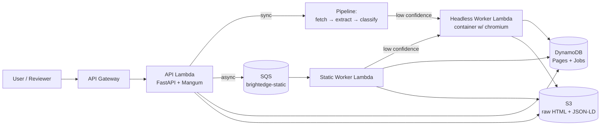

# BrightEdge Crawler — Take-Home Submission

A URL-to-topics service: given any URL, returns metadata (title, description,
OpenGraph, JSON-LD, body text, language) and a ranked list of topics.

**Live demo:** _URL and API key are shared in the submission email to BrightEdge._
**OpenAPI / Swagger UI:** _at `/docs` on the same URL._

> Since this is a public repo, the deployed URL and Bearer token are not
> published here. Reviewers: see the submission email for the demo URL and
> the API key. Without the key, all data endpoints return `401`.

## Submission contents

| Part | Deliverable |
|---|---|
| **Part 1 — Code & live demo** | This repository, deployed at the URL above |
| **Part 2 — Scale design** | [docs/part-2-scale-design.md](docs/part-2-scale-design.md) |
| **Part 3 — PoC plan** | [docs/part-3-poc-plan.md](docs/part-3-poc-plan.md) |

## Quick reference — the three test URLs

```bash
# Set both from the submission email
API=https://<api-id>.execute-api.us-east-1.amazonaws.com
KEY=<bearer-token-from-submission-email>

AUTH="-H \"Authorization: Bearer $KEY\""
JSON='-H "Content-Type: application/json"'

# 1. Amazon (anti-bot — uses headless fallback or fixture mode)
curl -X POST "$API/extract" -H "Authorization: Bearer $KEY" -H 'Content-Type: application/json' -d '{
  "url":"http://www.amazon.com/Cuisinart-CPT-122-Compact-2-SliceToaster/dp/B009GQ034C/ref=sr_1_1?s=kitchen&ie=UTF8&qid=1431620315&sr=1-1&keywords=toaster"
}' | jq

# Fixture fallback (saved response, see "Anti-bot" below):
curl -X POST "$API/extract?fixture=1" -H "Authorization: Bearer $KEY" -H 'Content-Type: application/json' -d '{
  "url":"http://www.amazon.com/Cuisinart-CPT-122-Compact-2-SliceToaster/dp/B009GQ034C/"
}' | jq

# 2. REI blog (clean static fetch)
curl -X POST "$API/extract" -H "Authorization: Bearer $KEY" -H 'Content-Type: application/json' -d '{
  "url":"http://blog.rei.com/camp/how-to-introduce-your-indoorsy-friend-to-the-outdoors/"
}' | jq

# 3. CNN tech article (clean static fetch)
curl -X POST "$API/extract" -H "Authorization: Bearer $KEY" -H 'Content-Type: application/json' -d '{
  "url":"https://www.cnn.com/2025/09/23/tech/google-study-90-percent-tech-jobs-ai"
}' | jq
```

The web form at `/` has a password field for the key — paste it once and
the browser remembers it via `localStorage` for subsequent extractions.

> ### A note on Lambda cold starts — please retry if a request fails
>
> The live demo runs entirely on AWS Lambda (zip-package API + static worker,
> container-image headless worker). After a period of inactivity each function
> goes cold and the **first** request has to:
>
> - Spin up a fresh micro-VM,
> - Mount the deployment artifact (the headless function pulls a ~500 MB
>   container image with chromium),
> - Import Python deps (`trafilatura`, `yake`, `playwright`, …),
> - Open boto3 / SQS clients.
>
> Expected cold-start latency (unverified; actual numbers vary with Lambda
> memory, image cache state, and AWS-internal scheduling): roughly **a few
> seconds for the API function** and **closer to ten seconds or more for the
> headless worker** the first time after a long idle period. You will
> occasionally see API Gateway return `504 Gateway Timeout` or `502 Bad
> Gateway` while a container image is still pulling. **If a request fails —
> especially the very first one in a session — just re-run the same `curl`
> command (or click "Extract" again in the web form).** The second call lands
> on a warm container and behaves normally (typically sub-second for static
> pages, a few seconds when the headless escalation fires).
>
> The static fetcher itself retries transient `httpx` errors up to 2 times
> (3 total attempts; see [`src/crawler/fetcher/static.py`](src/crawler/fetcher/static.py)),
> but a cold-start `504` from API Gateway happens *before* any code runs, so
> it can't be handled in-Lambda — it has to be retried by the client.

## Architecture (live system)



- **Sync path:** `POST /extract` — single URL, static fetch, escalate to headless if confidence < 0.5.
- **Async path:** `POST /batch` → SQS → static workers → headless escalation → `GET /jobs/{id}`.
- **Read cache:** `GET /pages?url=…` — last cached extraction from DynamoDB.

## Authentication

The deployed API requires `Authorization: Bearer <key>` on all data endpoints
(`/extract`, `/batch`, `/jobs/{id}`, `/pages`, `/pages/{url_hash}`). This
protects the public-repo deployment from abuse — the URL and key are shared
only with BrightEdge via the submission email.

Open endpoints (no auth required): `/`, `/health`, `/docs`, `/openapi.json`.

**Local development mode:** when the `API_KEY` env var is unset (its default
during local `uvicorn` runs and `pytest` runs), the dependency is a no-op and
all endpoints are unauthenticated. This keeps the dev loop friction-free.

Constant-time comparison via `hmac.compare_digest` prevents timing attacks.
401 responses include the RFC 6750-compliant `WWW-Authenticate: Bearer`
header. See [`src/crawler/api/auth.py`](src/crawler/api/auth.py).

## How topic classification works

Three signal layers fused into a ranked top-10:

1. **Heuristic candidates** from `<meta name="keywords">`, OpenGraph tags
   (`og:type`, `product:category`, `article:tag`), JSON-LD schema.org fields
   (`category`, `keywords`, `@type`). High precision, low recall.
2. **YAKE keyphrases** extracted from `trafilatura`-cleaned body text.
   High recall, fills topical gaps the meta tags miss.
3. **Fusion + scoring:** merge by normalized label, sum weighted contributions,
   normalize to [0,1], return top-K with score and source attribution.

See [src/crawler/classifier/](src/crawler/classifier/) and Part 2 §3 for
detailed weighting.

## Anti-bot handling

Amazon aggressively blocks scrapers. The crawler:

1. Tries a static fetch with a realistic browser User-Agent.
2. Scores extraction confidence — empty title, thin body, CAPTCHA fingerprint
   all drop it below 0.5.
3. Escalates to a Playwright-based headless worker (Lambda container image
   with chromium) which renders JavaScript and bypasses many anti-bot pages.
4. As a last-resort demo fallback, `?fixture=1` returns a saved response so
   reviewers see clean output regardless of network conditions. The fixture
   response is clearly labeled (`fetcher_used: "fixture"`, plus an
   `errors` entry).

See [docs/part-3-poc-plan.md](docs/part-3-poc-plan.md) for the Phase 1
hardening plan around real anti-bot defense.

## Local development

One-shot bootstrap (works on macOS and Linux):

```bash
git clone https://github.com/<you>/brightedge-crawler
cd brightedge-crawler
./scripts/setup.sh   # creates .venv, installs deps editable, runs all tests
```

> **macOS note:** `scripts/setup.sh` clears the `UF_HIDDEN` filesystem flag
> on `.venv/` after creating it. Without this, the editable-install `.pth`
> file is silently ignored when Python initializes site-packages, and
> `import crawler` fails. The script handles this transparently. If you
> skip the script and create `.venv` manually, run `chflags -R nohidden
> .venv` once after `python3.12 -m venv .venv`.

Then to run the server:

```bash
source .venv/bin/activate

# Run locally — no API key required when API_KEY env var is unset
uvicorn crawler.api.main:app --reload --port 8000
open http://localhost:8000/

# Run locally WITH auth enforced (matches the deployed behavior)
API_KEY="any-secret-you-pick" uvicorn crawler.api.main:app --port 8000
# Then send: curl -H 'Authorization: Bearer any-secret-you-pick' …

# Tests
pytest    # 89 tests
```

## Deployment

Full runbook (cross-arch image build, account-quota gotchas,
drift checks) is in **[`docs/deploy.md`](docs/deploy.md)**. Short version:

```bash
# Requires AWS CLI v2, SAM CLI ≥ 1.161, Docker w/ buildx, jq.
# Generate a key for this deployment — you'll share this with reviewers.
export AWS_PROFILE=brightedge-session     # MFA-backed session, see docs/deploy.md §1
export API_KEY="$(LC_ALL=C tr -dc 'A-Za-z0-9' < /dev/urandom | head -c 32)"
echo "Save this key — it will only be shown once: $API_KEY"

./scripts/deploy.sh

# Smoke-test the deployed stack (set API and KEY env vars first)
./scripts/smoke.sh
```

`scripts/deploy.sh` orchestrates the two-track build (zip functions via
SAM + headless container image via buildx), regenerates a skip-image
template so SAM doesn't try to rebuild the container, deploys, then
explicitly refreshes the Lambda image digest. See
[`docs/deploy.md` §2](docs/deploy.md) for why each step is necessary.

The deploy provisions:
- 3 Lambda functions (API, static-worker, headless-worker)
- HTTP API Gateway with Bearer-token auth at the application layer
- SQS queue + DLQ
- 2 DynamoDB tables (Pages with `by-domain` GSI; Jobs)
- 2 S3 buckets (raw HTML with lifecycle to Glacier; jobs)
- IAM roles + policies (least-privilege per function)

To re-roll the API key after deploy:
```bash
API_KEY="$(LC_ALL=C tr -dc 'A-Za-z0-9' < /dev/urandom | head -c 32)" ./scripts/deploy.sh
```

## AI tools used

Per the assignment's disclosure requirement:

- **Claude Code (Anthropic Opus 4.7)** — used throughout for:
  - design brainstorming (transcript in [docs/superpowers/specs/](docs/superpowers/specs/))
  - implementation plan ([docs/superpowers/plans/](docs/superpowers/plans/))
  - code generation for the FastAPI app, fetcher, extractor, classifier, workers, and IaC
  - documentation drafts (this README, Part 2, Part 3)

All code was reviewed and tested by the author before commit. No other AI
tools were used.

## Repository layout

```
src/crawler/
├── api/          FastAPI app + routes + Pydantic schemas
├── fetcher/      Static (httpx) + headless (Playwright) + confidence scorer
├── extractor/    Meta, OpenGraph, JSON-LD, body (trafilatura), language
├── classifier/   Heuristics + YAKE keyphrases + topic fusion
├── storage/      URL hashing, S3 wrappers, DynamoDB accessors
├── workers/      Static SQS worker + headless Lambda worker
├── config.py     Env-driven settings
└── pipeline.py   End-to-end orchestration
infra/            SAM template + headless Dockerfile
web/              Minimal HTML demo form
tests/            Unit + integration tests + saved HTML fixtures
docs/             Submission docs + design spec + implementation plan
scripts/          deploy.sh, smoke.sh, download_fixtures.sh
```
