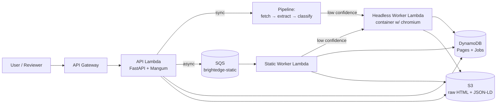

# BrightEdge Crawler — 48-Hour Build Plan

> **For agentic workers:** REQUIRED SUB-SKILL: Use superpowers:subagent-driven-development (recommended) or superpowers:executing-plans to implement this plan task-by-task. Steps use checkbox (`- [ ]`) syntax for tracking.

**Goal:** Ship a deployed AWS crawler service that takes a URL and returns metadata + ranked topics, with sync and async paths, plus three submission documents (README, Part 2 scale-design, Part 3 PoC plan), in under 48 hours.

**Architecture:** Python 3.12 FastAPI app on AWS Lambda (Mangum-wrapped) behind API Gateway. Static fetcher (`httpx`) with confidence-driven escalation to a Playwright headless worker (Lambda container image). Per-domain SQS sharding for async batch processing. DynamoDB for hot metadata, S3 for raw HTML + JSON-LD blobs. Three Lambda functions: API, static-worker, headless-worker. Infrastructure as code via AWS SAM. See [the design spec](../specs/2026-05-23-brightedge-crawler-design.md) for full context.

**Tech Stack:**
- Python 3.12, FastAPI 0.115, Mangum 0.17, Pydantic 2
- `httpx`, `beautifulsoup4`, `lxml`, `trafilatura`, `langdetect`, `yake`, `tldextract`, `protego` (robots.txt)
- `boto3`, `aws-lambda-powertools`
- `playwright` 1.49 (in Lambda container image for headless worker)
- `pytest`, `pytest-asyncio`, `respx` (HTTP mocking), `moto` (AWS mocking), `ruff` (lint + format)
- AWS SAM CLI for deployment
- GitHub for source hosting, AWS for runtime hosting

**Build target outcome at code-freeze (H22):**
- `POST /extract` returns metadata + ranked topics for the 3 test URLs
- `POST /batch` of 10 URLs → SQS → worker writes results to S3/DynamoDB
- `GET /jobs/{job_id}` reports status
- `GET /pages?url=…` returns last cached extraction
- `GET /` serves a minimal HTML form
- `GET /docs` serves FastAPI Swagger UI
- Confidence-driven escalation to headless worker on low-signal pages

---

## File structure (mapped before tasks)

```
/Users/userongrid/Documents/BrightEdge_Assignment/
├── README.md                                       # submission entry point
├── pyproject.toml                                  # project metadata + deps
├── requirements.txt                                # pinned runtime deps
├── requirements-dev.txt                            # pinned dev deps
├── samconfig.toml                                  # SAM CLI config
├── .gitignore                                      # (exists)
├── docs/
│   ├── superpowers/
│   │   ├── specs/2026-05-23-brightedge-crawler-design.md   # (exists)
│   │   └── plans/2026-05-23-brightedge-crawler-build.md    # THIS FILE
│   ├── part-2-scale-design.md                      # submission Part 2
│   ├── part-3-poc-plan.md                          # submission Part 3
│   └── architecture.md                             # diagrams + cost tables
├── infra/
│   ├── template.yaml                               # SAM template (all AWS resources)
│   └── headless.Dockerfile                         # Playwright Lambda container image
├── src/
│   └── crawler/
│       ├── __init__.py
│       ├── config.py                               # env-var-driven settings
│       ├── logging.py                              # structured JSON logging
│       ├── api/
│       │   ├── __init__.py
│       │   ├── main.py                             # FastAPI app + Mangum handler
│       │   ├── routes.py                           # all HTTP endpoints
│       │   └── schemas.py                          # Pydantic models
│       ├── fetcher/
│       │   ├── __init__.py
│       │   ├── user_agents.py                      # realistic UA strings
│       │   ├── robots.py                           # robots.txt cache + parse
│       │   ├── static.py                           # httpx-based fetcher
│       │   ├── headless.py                         # invokes headless Lambda
│       │   └── confidence.py                       # 0-1 confidence scorer
│       ├── extractor/
│       │   ├── __init__.py
│       │   ├── meta.py                             # title/meta/OG/Twitter/canonical
│       │   ├── jsonld.py                           # JSON-LD + microdata
│       │   ├── body.py                             # trafilatura body text
│       │   └── language.py                         # langdetect wrapper
│       ├── classifier/
│       │   ├── __init__.py
│       │   ├── heuristics.py                       # meta/OG/schema → candidates
│       │   ├── keyphrases.py                       # YAKE keyphrases
│       │   └── fuse.py                             # merge + dedupe + score
│       ├── storage/
│       │   ├── __init__.py
│       │   ├── hashing.py                          # url normalization + SHA-256
│       │   ├── s3.py                               # S3 client wrappers
│       │   └── dynamo.py                           # DDB Pages/Jobs accessors
│       ├── workers/
│       │   ├── __init__.py
│       │   ├── static_worker.py                    # SQS handler
│       │   └── headless_worker.py                  # Lambda handler (in container)
│       └── pipeline.py                             # fetch → extract → classify → persist
├── web/
│   └── index.html                                  # minimal demo form (served by FastAPI)
├── tests/
│   ├── __init__.py
│   ├── conftest.py                                 # shared fixtures
│   ├── fixtures/
│   │   ├── amazon_toaster.html                     # saved HTML
│   │   ├── rei_outdoors.html
│   │   └── cnn_tech.html
│   ├── unit/
│   │   ├── test_storage_hashing.py
│   │   ├── test_extractor_meta.py
│   │   ├── test_extractor_jsonld.py
│   │   ├── test_extractor_body.py
│   │   ├── test_extractor_language.py
│   │   ├── test_classifier_heuristics.py
│   │   ├── test_classifier_keyphrases.py
│   │   ├── test_classifier_fuse.py
│   │   ├── test_fetcher_static.py
│   │   ├── test_fetcher_confidence.py
│   │   ├── test_pipeline.py
│   │   └── test_api_routes.py
│   └── integration/
│       └── test_smoke_live.py                      # hits the deployed URL
└── scripts/
    ├── deploy.sh                                   # wraps sam build && sam deploy
    ├── download_fixtures.sh                        # refreshes saved HTML fixtures
    └── smoke.sh                                    # curls 3 test URLs against demo
```

---

## Phase A — Scaffold & AWS plumbing (target H0–H2)

### Task 1: Python project skeleton

**Files:**
- Create: `pyproject.toml`
- Create: `requirements.txt`
- Create: `requirements-dev.txt`
- Create: `src/crawler/__init__.py`
- Create: `tests/__init__.py`
- Create: `tests/conftest.py`

- [ ] **Step 1: Create `pyproject.toml`**

```toml
[project]
name = "brightedge-crawler"
version = "0.1.0"
description = "URL-to-topics crawler service (BrightEdge take-home)"
requires-python = ">=3.12"
readme = "README.md"
dependencies = [
    "fastapi==0.115.4",
    "mangum==0.17.0",
    "pydantic==2.9.2",
    "httpx==0.27.2",
    "beautifulsoup4==4.12.3",
    "lxml==5.3.0",
    "trafilatura==1.12.2",
    "langdetect==1.0.9",
    "yake==0.4.8",
    "tldextract==5.1.2",
    "protego==0.3.1",
    "boto3==1.35.50",
    "aws-lambda-powertools==3.2.0",
]

[project.optional-dependencies]
dev = [
    "pytest==8.3.3",
    "pytest-asyncio==0.24.0",
    "respx==0.21.1",
    "moto[s3,dynamodb,sqs]==5.0.18",
    "ruff==0.7.1",
]

[build-system]
requires = ["setuptools>=68.0", "wheel"]
build-backend = "setuptools.build_meta"

[tool.setuptools.packages.find]
where = ["src"]

[tool.pytest.ini_options]
testpaths = ["tests"]
asyncio_mode = "auto"
pythonpath = ["src"]

[tool.ruff]
line-length = 100
target-version = "py312"

[tool.ruff.lint]
select = ["E", "F", "I", "B", "UP", "N", "S"]
ignore = ["S101"]  # allow `assert` in tests
```

- [ ] **Step 2: Create `requirements.txt`** (matches dependencies above, for SAM/Lambda packaging)

```
fastapi==0.115.4
mangum==0.17.0
pydantic==2.9.2
httpx==0.27.2
beautifulsoup4==4.12.3
lxml==5.3.0
trafilatura==1.12.2
langdetect==1.0.9
yake==0.4.8
tldextract==5.1.2
protego==0.3.1
boto3==1.35.50
aws-lambda-powertools==3.2.0
```

- [ ] **Step 3: Create `requirements-dev.txt`**

```
-r requirements.txt
pytest==8.3.3
pytest-asyncio==0.24.0
respx==0.21.1
moto[s3,dynamodb,sqs]==5.0.18
ruff==0.7.1
```

- [ ] **Step 4: Create directory structure**

```bash
mkdir -p src/crawler/{api,fetcher,extractor,classifier,storage,workers}
mkdir -p tests/{unit,integration,fixtures}
mkdir -p infra web scripts
touch src/crawler/__init__.py src/crawler/api/__init__.py src/crawler/fetcher/__init__.py
touch src/crawler/extractor/__init__.py src/crawler/classifier/__init__.py
touch src/crawler/storage/__init__.py src/crawler/workers/__init__.py
touch tests/__init__.py tests/unit/__init__.py tests/integration/__init__.py
```

- [ ] **Step 5: Create `tests/conftest.py`**

```python
"""Shared test fixtures."""
from __future__ import annotations

from pathlib import Path

import pytest

FIXTURES_DIR = Path(__file__).parent / "fixtures"


@pytest.fixture
def fixture_html() -> dict[str, str]:
    """Return saved HTML for the three test URLs as a dict keyed by short name."""
    files = {
        "amazon": FIXTURES_DIR / "amazon_toaster.html",
        "rei": FIXTURES_DIR / "rei_outdoors.html",
        "cnn": FIXTURES_DIR / "cnn_tech.html",
    }
    return {key: path.read_text(encoding="utf-8") for key, path in files.items() if path.exists()}
```

- [ ] **Step 6: Install deps & verify**

```bash
python3.12 -m venv .venv
source .venv/bin/activate
pip install -e ".[dev]"
pytest --version  # should print pytest 8.3.3
```

- [ ] **Step 7: Commit**

```bash
git add pyproject.toml requirements.txt requirements-dev.txt src/ tests/ infra/ web/ scripts/
git commit -m "chore: bootstrap python project skeleton"
```

---

### Task 2: FastAPI hello world (local)

**Files:**
- Create: `src/crawler/api/main.py`
- Create: `src/crawler/api/routes.py`
- Create: `tests/unit/test_api_routes.py`

- [ ] **Step 1: Write the failing test**

`tests/unit/test_api_routes.py`:
```python
"""Smoke tests for the FastAPI app."""
from fastapi.testclient import TestClient

from crawler.api.main import app


def test_health_endpoint_returns_ok():
    client = TestClient(app)
    response = client.get("/health")
    assert response.status_code == 200
    assert response.json() == {"status": "ok"}
```

- [ ] **Step 2: Run test (expect fail)**

```bash
pytest tests/unit/test_api_routes.py -v
```
Expected: `ImportError: cannot import name 'app' from 'crawler.api.main'`

- [ ] **Step 3: Implement `src/crawler/api/main.py`**

```python
"""FastAPI app entrypoint + Lambda handler."""
from __future__ import annotations

from fastapi import FastAPI
from mangum import Mangum

from crawler.api.routes import router

app = FastAPI(title="BrightEdge Crawler", version="0.1.0", docs_url="/docs", redoc_url=None)
app.include_router(router)


@app.get("/health", tags=["meta"])
def health() -> dict[str, str]:
    return {"status": "ok"}


# Lambda entry point
handler = Mangum(app, lifespan="off")
```

- [ ] **Step 4: Implement `src/crawler/api/routes.py` (stub for now)**

```python
"""HTTP routes. Endpoints get filled in as features land."""
from __future__ import annotations

from fastapi import APIRouter

router = APIRouter()
```

- [ ] **Step 5: Run test (expect pass)**

```bash
pytest tests/unit/test_api_routes.py -v
```
Expected: `1 passed`

- [ ] **Step 6: Run app locally to confirm**

```bash
uvicorn crawler.api.main:app --reload --port 8000
# In another terminal:
curl http://localhost:8000/health
# expect: {"status":"ok"}
curl http://localhost:8000/docs  # Swagger UI HTML
```

- [ ] **Step 7: Commit**

```bash
git add src/crawler/api/ tests/unit/test_api_routes.py
git commit -m "feat(api): scaffold FastAPI app with /health and Mangum handler"
```

---

### Task 3: SAM hello-world Lambda deployed (RISK GATE 1)

**Goal:** Verify AWS deploy plumbing works *before* writing real code.

**Files:**
- Create: `infra/template.yaml` (minimal)
- Create: `samconfig.toml`
- Create: `scripts/deploy.sh`

- [ ] **Step 1: Create minimal `infra/template.yaml`**

```yaml
AWSTemplateFormatVersion: '2010-09-09'
Transform: AWS::Serverless-2016-10-31
Description: BrightEdge Crawler — initial Lambda hello world

Globals:
  Function:
    Runtime: python3.12
    Timeout: 30
    MemorySize: 1024
    Architectures: [x86_64]
    Environment:
      Variables:
        LOG_LEVEL: INFO

Resources:
  ApiFunction:
    Type: AWS::Serverless::Function
    Properties:
      FunctionName: brightedge-crawler-api
      CodeUri: ../
      Handler: crawler.api.main.handler
      Events:
        ApiRoot:
          Type: HttpApi
          Properties:
            Path: /{proxy+}
            Method: ANY
        ApiBase:
          Type: HttpApi
          Properties:
            Path: /
            Method: ANY

Outputs:
  ApiUrl:
    Description: HTTP API endpoint
    Value: !Sub "https://${ServerlessHttpApi}.execute-api.${AWS::Region}.amazonaws.com"
```

- [ ] **Step 2: Create `samconfig.toml`**

```toml
version = 0.1

[default.global.parameters]
stack_name = "brightedge-crawler"

[default.build.parameters]
cached = true
parallel = true

[default.deploy.parameters]
region = "us-east-1"
confirm_changeset = false
capabilities = "CAPABILITY_IAM"
resolve_s3 = true
fail_on_empty_changeset = false
```

- [ ] **Step 3: Create `scripts/deploy.sh`**

```bash
#!/usr/bin/env bash
# Deploy the SAM stack. Run from repo root.
set -euo pipefail

cd "$(dirname "$0")/.."

sam build --template infra/template.yaml --use-container=false
sam deploy --template-file .aws-sam/build/template.yaml --config-file ../samconfig.toml
```

```bash
chmod +x scripts/deploy.sh
```

- [ ] **Step 4: Verify SAM is installed**

```bash
sam --version  # should be >= 1.124
# If missing on macOS: brew install aws-sam-cli
```

- [ ] **Step 5: Build & deploy**

```bash
aws configure list  # confirm credentials and region
./scripts/deploy.sh
```

Expected: stack creates successfully, prints an `ApiUrl` output like `https://abc123.execute-api.us-east-1.amazonaws.com`.

- [ ] **Step 6: Hit the deployed URL**

```bash
API_URL=$(aws cloudformation describe-stacks --stack-name brightedge-crawler \
  --query "Stacks[0].Outputs[?OutputKey=='ApiUrl'].OutputValue" --output text)
curl "$API_URL/health"
```
Expected: `{"status":"ok"}` (may take 1–2s on cold start)

- [ ] **Step 7: Commit**

```bash
git add infra/ samconfig.toml scripts/deploy.sh
git commit -m "infra: deploy hello-world Lambda via SAM (risk gate 1)"
```

---

## Phase B — Static fetcher (target H2–H4)

### Task 4: URL normalization + hashing

**Files:**
- Create: `src/crawler/storage/hashing.py`
- Create: `tests/unit/test_storage_hashing.py`

- [ ] **Step 1: Write the failing test**

`tests/unit/test_storage_hashing.py`:
```python
"""Tests for URL normalization and hashing."""
import pytest

from crawler.storage.hashing import normalize_url, url_hash


def test_normalize_lowercases_host():
    assert normalize_url("HTTP://Example.COM/Path") == "http://example.com/Path"


def test_normalize_strips_fragment():
    assert normalize_url("https://example.com/p#section") == "https://example.com/p"


def test_normalize_sorts_query_params():
    assert (
        normalize_url("https://example.com/p?b=2&a=1")
        == "https://example.com/p?a=1&b=2"
    )


def test_normalize_drops_default_port():
    assert normalize_url("https://example.com:443/p") == "https://example.com/p"
    assert normalize_url("http://example.com:80/p") == "http://example.com/p"


def test_url_hash_is_deterministic():
    a = url_hash("https://example.com/p?a=1&b=2")
    b = url_hash("https://example.com/p?b=2&a=1")
    assert a == b
    assert len(a) == 64  # SHA-256 hex


def test_url_hash_differs_for_different_urls():
    assert url_hash("https://example.com/a") != url_hash("https://example.com/b")
```

- [ ] **Step 2: Run tests (expect fail)**

```bash
pytest tests/unit/test_storage_hashing.py -v
```

- [ ] **Step 3: Implement `src/crawler/storage/hashing.py`**

```python
"""URL normalization and SHA-256 hashing."""
from __future__ import annotations

import hashlib
from urllib.parse import parse_qsl, urlencode, urlsplit, urlunsplit

_DEFAULT_PORTS = {"http": 80, "https": 443}


def normalize_url(url: str) -> str:
    """Lowercase host, drop fragment, sort query, drop default ports."""
    parts = urlsplit(url.strip())
    scheme = parts.scheme.lower()
    netloc = parts.netloc.lower()

    if ":" in netloc:
        host, _, port = netloc.rpartition(":")
        if port.isdigit() and _DEFAULT_PORTS.get(scheme) == int(port):
            netloc = host

    query_pairs = sorted(parse_qsl(parts.query, keep_blank_values=True))
    query = urlencode(query_pairs)

    return urlunsplit((scheme, netloc, parts.path, query, ""))


def url_hash(url: str) -> str:
    """SHA-256 hex digest of the normalized URL."""
    return hashlib.sha256(normalize_url(url).encode("utf-8")).hexdigest()
```

- [ ] **Step 4: Run tests (expect pass)**

```bash
pytest tests/unit/test_storage_hashing.py -v
```

- [ ] **Step 5: Commit**

```bash
git add src/crawler/storage/hashing.py tests/unit/test_storage_hashing.py
git commit -m "feat(storage): add URL normalization and SHA-256 hashing"
```

---

### Task 5: Static fetcher

**Files:**
- Create: `src/crawler/fetcher/user_agents.py`
- Create: `src/crawler/fetcher/static.py`
- Create: `tests/unit/test_fetcher_static.py`

- [ ] **Step 1: Create user-agent pool**

`src/crawler/fetcher/user_agents.py`:
```python
"""Realistic browser User-Agent strings for politeness."""
from __future__ import annotations

import random

USER_AGENTS = [
    "Mozilla/5.0 (Macintosh; Intel Mac OS X 14_5) AppleWebKit/605.1.15 "
    "(KHTML, like Gecko) Version/17.5 Safari/605.1.15",
    "Mozilla/5.0 (Windows NT 10.0; Win64; x64) AppleWebKit/537.36 "
    "(KHTML, like Gecko) Chrome/130.0.0.0 Safari/537.36",
    "Mozilla/5.0 (X11; Linux x86_64) AppleWebKit/537.36 "
    "(KHTML, like Gecko) Chrome/130.0.0.0 Safari/537.36",
]


def pick() -> str:
    return random.choice(USER_AGENTS)  # noqa: S311
```

- [ ] **Step 2: Write the failing test**

`tests/unit/test_fetcher_static.py`:
```python
"""Tests for the static httpx fetcher."""
import httpx
import pytest
import respx

from crawler.fetcher.static import FetchResult, fetch


@pytest.mark.asyncio
async def test_fetch_returns_html_and_status():
    async with respx.mock(assert_all_called=True) as router:
        router.get("https://example.com/").mock(
            return_value=httpx.Response(200, text="<html><title>Hi</title></html>",
                                        headers={"content-type": "text/html"})
        )
        result = await fetch("https://example.com/")
        assert isinstance(result, FetchResult)
        assert result.http_status == 200
        assert "<title>Hi</title>" in result.html
        assert result.content_type.startswith("text/html")
        assert result.final_url == "https://example.com/"


@pytest.mark.asyncio
async def test_fetch_follows_redirects():
    async with respx.mock(assert_all_called=True) as router:
        router.get("https://example.com/old").mock(
            return_value=httpx.Response(301, headers={"location": "https://example.com/new"})
        )
        router.get("https://example.com/new").mock(
            return_value=httpx.Response(200, text="redirected", headers={"content-type": "text/html"})
        )
        result = await fetch("https://example.com/old")
        assert result.http_status == 200
        assert result.final_url == "https://example.com/new"
        assert result.html == "redirected"


@pytest.mark.asyncio
async def test_fetch_handles_non_html():
    async with respx.mock(assert_all_called=True) as router:
        router.get("https://example.com/a.json").mock(
            return_value=httpx.Response(200, text='{"a":1}', headers={"content-type": "application/json"})
        )
        result = await fetch("https://example.com/a.json")
        assert result.content_type == "application/json"
        assert result.html == '{"a":1}'
```

- [ ] **Step 3: Run tests (expect fail)**

- [ ] **Step 4: Implement `src/crawler/fetcher/static.py`**

```python
"""Static HTTP fetcher with retries, realistic headers, redirect following."""
from __future__ import annotations

from dataclasses import dataclass

import httpx

from crawler.fetcher.user_agents import pick as pick_ua

DEFAULT_TIMEOUT = httpx.Timeout(connect=5.0, read=15.0, write=5.0, pool=5.0)
DEFAULT_MAX_BYTES = 5_000_000  # 5 MB hard cap on HTML body
DEFAULT_RETRIES = 2


@dataclass(frozen=True)
class FetchResult:
    url: str
    final_url: str
    http_status: int
    content_type: str
    html: str
    fetched_via: str = "static"


def _headers() -> dict[str, str]:
    return {
        "User-Agent": pick_ua(),
        "Accept": "text/html,application/xhtml+xml,application/xml;q=0.9,*/*;q=0.8",
        "Accept-Language": "en-US,en;q=0.9",
        "Accept-Encoding": "gzip, deflate, br",
        "Cache-Control": "no-cache",
    }


async def fetch(
    url: str,
    *,
    timeout: httpx.Timeout = DEFAULT_TIMEOUT,
    max_bytes: int = DEFAULT_MAX_BYTES,
    retries: int = DEFAULT_RETRIES,
) -> FetchResult:
    """Fetch a URL with retries, returning headers + body. Raises on terminal failure."""
    last_exc: Exception | None = None
    transport = httpx.AsyncHTTPTransport(retries=0)
    async with httpx.AsyncClient(
        follow_redirects=True,
        timeout=timeout,
        headers=_headers(),
        transport=transport,
        http2=False,
    ) as client:
        for attempt in range(retries + 1):
            try:
                response = await client.get(url)
                content = response.content[:max_bytes]
                text = content.decode(
                    response.charset_encoding or "utf-8", errors="replace"
                )
                return FetchResult(
                    url=url,
                    final_url=str(response.url),
                    http_status=response.status_code,
                    content_type=response.headers.get("content-type", "").split(";")[0].strip(),
                    html=text,
                )
            except (httpx.RequestError, httpx.HTTPError) as exc:
                last_exc = exc
                if attempt == retries:
                    raise
    raise RuntimeError(f"Unreachable: last_exc={last_exc!r}")
```

- [ ] **Step 5: Run tests (expect pass)**

```bash
pytest tests/unit/test_fetcher_static.py -v
```

- [ ] **Step 6: Commit**

```bash
git add src/crawler/fetcher/user_agents.py src/crawler/fetcher/static.py \
        tests/unit/test_fetcher_static.py
git commit -m "feat(fetcher): static httpx fetcher with retries and realistic headers"
```

---

### Task 6: robots.txt cache (minimum viable)

**Files:**
- Create: `src/crawler/fetcher/robots.py`

For PoC: in-process LRU cache only. Per-domain DDB token bucket is Phase 1 work.

- [ ] **Step 1: Implement `src/crawler/fetcher/robots.py`**

```python
"""Minimal robots.txt fetcher + cache. Per-domain TTL ~24h.

For PoC we ship an in-process LRU; production uses DynamoDB-backed cache
(see design spec §7.4).
"""
from __future__ import annotations

import time
from dataclasses import dataclass
from urllib.parse import urlsplit

import httpx
from protego import Protego

_CACHE: dict[str, tuple[Protego, float]] = {}
_TTL_SECONDS = 24 * 60 * 60


@dataclass(frozen=True)
class RobotsDecision:
    allowed: bool
    crawl_delay: float | None


async def can_fetch(url: str, user_agent: str) -> RobotsDecision:
    """Return whether `url` is permitted, and any crawl-delay (seconds)."""
    parts = urlsplit(url)
    origin = f"{parts.scheme}://{parts.netloc}"
    robots_url = f"{origin}/robots.txt"

    now = time.time()
    cached = _CACHE.get(origin)
    if cached is None or now - cached[1] > _TTL_SECONDS:
        parser = await _load(robots_url)
        _CACHE[origin] = (parser, now)
    else:
        parser = cached[0]

    return RobotsDecision(
        allowed=parser.can_fetch(url, user_agent),
        crawl_delay=parser.crawl_delay(user_agent),
    )


async def _load(robots_url: str) -> Protego:
    try:
        async with httpx.AsyncClient(timeout=httpx.Timeout(5.0)) as client:
            response = await client.get(robots_url, follow_redirects=True)
            if response.status_code == 200:
                return Protego.parse(response.text)
    except httpx.HTTPError:
        pass
    # No robots.txt or unreachable → permissive
    return Protego.parse("")
```

- [ ] **Step 2: Commit**

```bash
git add src/crawler/fetcher/robots.py
git commit -m "feat(fetcher): robots.txt cache (in-process for PoC)"
```

---

## Phase C — Extractor (target H4–H6)

### Task 7: Download HTML fixtures

**Files:**
- Create: `scripts/download_fixtures.sh`
- Create: `tests/fixtures/amazon_toaster.html`
- Create: `tests/fixtures/rei_outdoors.html`
- Create: `tests/fixtures/cnn_tech.html`

- [ ] **Step 1: Create `scripts/download_fixtures.sh`**

```bash
#!/usr/bin/env bash
# Download HTML for the three test URLs into tests/fixtures/.
# Useful so unit tests can run offline and deterministically.
set -euo pipefail
cd "$(dirname "$0")/.."
mkdir -p tests/fixtures

UA="Mozilla/5.0 (Macintosh; Intel Mac OS X 14_5) AppleWebKit/605.1.15 (KHTML, like Gecko) Version/17.5 Safari/605.1.15"

curl -sL -A "$UA" \
  "http://www.amazon.com/Cuisinart-CPT-122-Compact-2-SliceToaster/dp/B009GQ034C/" \
  -o tests/fixtures/amazon_toaster.html || echo "Amazon fetch failed (expected with anti-bot); we ship a saved copy."

curl -sL -A "$UA" \
  "http://blog.rei.com/camp/how-to-introduce-your-indoorsy-friend-to-the-outdoors/" \
  -o tests/fixtures/rei_outdoors.html

curl -sL -A "$UA" \
  "https://www.cnn.com/2025/09/23/tech/google-study-90-percent-tech-jobs-ai" \
  -o tests/fixtures/cnn_tech.html

echo "Fixture sizes:"
wc -c tests/fixtures/*.html
```

```bash
chmod +x scripts/download_fixtures.sh
./scripts/download_fixtures.sh
```

- [ ] **Step 2: If Amazon returns a CAPTCHA page or fails, hand-create a minimal fixture**

If `amazon_toaster.html` is tiny or contains "Robot Check", create a placeholder fixture with realistic structure. This is OK for unit tests; the live demo will use the headless fallback to handle Amazon.

Hand-write `tests/fixtures/amazon_toaster.html` if needed:
```html
<!DOCTYPE html>
<html lang="en">
<head>
<title>Amazon.com: Cuisinart CPT-122 Compact 2-Slice Toaster (White)</title>
<meta name="description" content="Cuisinart's CPT-122 is a compact 2-slice toaster with dual reheat, defrost, and bagel controls.">
<meta property="og:type" content="product">
<meta property="og:title" content="Cuisinart CPT-122 Compact 2-Slice Toaster">
<meta property="og:image" content="https://images.amazon.com/cpt-122.jpg">
<meta property="product:category" content="Kitchen Toasters">
<script type="application/ld+json">
{"@context":"https://schema.org","@type":"Product","name":"Cuisinart CPT-122 Compact 2-Slice Toaster","category":"Kitchen > Small Appliances > Toasters","brand":{"@type":"Brand","name":"Cuisinart"},"offers":{"@type":"Offer","price":"39.99","priceCurrency":"USD"}}
</script>
</head>
<body>
<h1>Cuisinart CPT-122 Compact 2-Slice Toaster</h1>
<div id="productDescription">
<p>Compact design, dual control panels with 6 browning levels, reheat, defrost, and bagel options. Removable crumb tray. Stainless-steel housing.</p>
</div>
</body>
</html>
```

- [ ] **Step 3: Commit**

```bash
git add scripts/download_fixtures.sh tests/fixtures/
git commit -m "test: add saved HTML fixtures for the three test URLs"
```

---

### Task 8: Meta / OG / Twitter / canonical extractor

**Files:**
- Create: `src/crawler/extractor/meta.py`
- Create: `tests/unit/test_extractor_meta.py`

- [ ] **Step 1: Write the failing tests**

`tests/unit/test_extractor_meta.py`:
```python
"""Tests for HTML meta extraction."""
from crawler.extractor.meta import MetaTags, extract_meta


def test_extract_title():
    html = "<html><head><title>Hello</title></head></html>"
    assert extract_meta(html).title == "Hello"


def test_extract_meta_description():
    html = '<html><head><meta name="description" content="Desc"></head></html>'
    assert extract_meta(html).description == "Desc"


def test_extract_og_tags():
    html = """<html><head>
        <meta property="og:title" content="OG Title">
        <meta property="og:type" content="product">
        <meta property="og:image" content="https://example.com/img.jpg">
    </head></html>"""
    meta = extract_meta(html)
    assert meta.open_graph["og:title"] == "OG Title"
    assert meta.open_graph["og:type"] == "product"


def test_extract_twitter_card():
    html = """<html><head>
        <meta name="twitter:card" content="summary_large_image">
        <meta name="twitter:title" content="Tweet">
    </head></html>"""
    meta = extract_meta(html)
    assert meta.twitter_card["twitter:card"] == "summary_large_image"


def test_extract_canonical_url():
    html = '<html><head><link rel="canonical" href="https://example.com/x"></head></html>'
    assert extract_meta(html).canonical_url == "https://example.com/x"


def test_extract_meta_keywords():
    html = '<html><head><meta name="keywords" content="toaster, kitchen, cuisinart"></head></html>'
    meta = extract_meta(html)
    assert meta.keywords == ["toaster", "kitchen", "cuisinart"]


def test_handles_missing_head():
    html = "<html><body>No head</body></html>"
    meta = extract_meta(html)
    assert meta.title is None
    assert meta.description is None


def test_rei_fixture_extracts_title(fixture_html):
    if "rei" not in fixture_html:
        return  # fixture optional in CI
    meta = extract_meta(fixture_html["rei"])
    assert meta.title is not None
    assert len(meta.title) > 0
```

- [ ] **Step 2: Run tests (expect fail)**

- [ ] **Step 3: Implement `src/crawler/extractor/meta.py`**

```python
"""Extract <title>, <meta>, OpenGraph, Twitter Card, canonical, keywords."""
from __future__ import annotations

from dataclasses import dataclass, field

from bs4 import BeautifulSoup


@dataclass
class MetaTags:
    title: str | None = None
    description: str | None = None
    canonical_url: str | None = None
    keywords: list[str] = field(default_factory=list)
    open_graph: dict[str, str] = field(default_factory=dict)
    twitter_card: dict[str, str] = field(default_factory=dict)
    raw_meta: dict[str, str] = field(default_factory=dict)


def extract_meta(html: str) -> MetaTags:
    soup = BeautifulSoup(html, "lxml")
    meta = MetaTags()

    if soup.title and soup.title.string:
        meta.title = soup.title.string.strip()

    for tag in soup.find_all("meta"):
        name = (tag.get("name") or "").lower().strip()
        prop = (tag.get("property") or "").lower().strip()
        content = tag.get("content")
        if not content:
            continue
        content = content.strip()
        if name == "description":
            meta.description = content
        if name == "keywords":
            meta.keywords = [k.strip().lower() for k in content.split(",") if k.strip()]
        if prop.startswith("og:"):
            meta.open_graph[prop] = content
        if name.startswith("twitter:"):
            meta.twitter_card[name] = content
        if name:
            meta.raw_meta[name] = content

    link = soup.find("link", rel="canonical")
    if link and link.get("href"):
        meta.canonical_url = link["href"].strip()

    return meta
```

- [ ] **Step 4: Run tests (expect pass)**

- [ ] **Step 5: Commit**

```bash
git add src/crawler/extractor/meta.py tests/unit/test_extractor_meta.py
git commit -m "feat(extractor): title, meta, OG, Twitter Card, canonical, keywords"
```

---

### Task 9: JSON-LD / microdata extractor

**Files:**
- Create: `src/crawler/extractor/jsonld.py`
- Create: `tests/unit/test_extractor_jsonld.py`

- [ ] **Step 1: Write the failing tests**

```python
"""Tests for JSON-LD extraction."""
from crawler.extractor.jsonld import extract_jsonld


def test_extract_single_jsonld_block():
    html = '''
    <html><head><script type="application/ld+json">
    {"@context":"https://schema.org","@type":"Product","name":"X"}
    </script></head></html>
    '''
    blocks = extract_jsonld(html)
    assert len(blocks) == 1
    assert blocks[0]["@type"] == "Product"
    assert blocks[0]["name"] == "X"


def test_extract_multiple_jsonld_blocks():
    html = '''
    <html><head>
    <script type="application/ld+json">{"@type":"Article","headline":"A"}</script>
    <script type="application/ld+json">{"@type":"BreadcrumbList"}</script>
    </head></html>
    '''
    blocks = extract_jsonld(html)
    assert len(blocks) == 2


def test_extract_jsonld_array():
    html = '''
    <html><head><script type="application/ld+json">
    [{"@type":"Product","name":"A"},{"@type":"Product","name":"B"}]
    </script></head></html>
    '''
    blocks = extract_jsonld(html)
    assert len(blocks) == 2
    assert {b["name"] for b in blocks} == {"A", "B"}


def test_extract_jsonld_skips_malformed():
    html = '''
    <html><head>
    <script type="application/ld+json">{not json}</script>
    <script type="application/ld+json">{"@type":"Article"}</script>
    </head></html>
    '''
    blocks = extract_jsonld(html)
    assert len(blocks) == 1
    assert blocks[0]["@type"] == "Article"
```

- [ ] **Step 2: Run tests (expect fail)**

- [ ] **Step 3: Implement `src/crawler/extractor/jsonld.py`**

```python
"""Extract JSON-LD structured data blocks."""
from __future__ import annotations

import json
from typing import Any

from bs4 import BeautifulSoup


def extract_jsonld(html: str) -> list[dict[str, Any]]:
    """Return all valid JSON-LD blocks as a flat list of dicts."""
    soup = BeautifulSoup(html, "lxml")
    blocks: list[dict[str, Any]] = []
    for script in soup.find_all("script", attrs={"type": "application/ld+json"}):
        text = (script.string or script.get_text() or "").strip()
        if not text:
            continue
        try:
            parsed = json.loads(text)
        except json.JSONDecodeError:
            continue
        if isinstance(parsed, list):
            for item in parsed:
                if isinstance(item, dict):
                    blocks.append(item)
        elif isinstance(parsed, dict):
            blocks.append(parsed)
    return blocks
```

- [ ] **Step 4: Run tests (expect pass)**

- [ ] **Step 5: Commit**

```bash
git add src/crawler/extractor/jsonld.py tests/unit/test_extractor_jsonld.py
git commit -m "feat(extractor): JSON-LD / schema.org block parsing"
```

---

### Task 10: Body extractor (trafilatura) + language

**Files:**
- Create: `src/crawler/extractor/body.py`
- Create: `src/crawler/extractor/language.py`
- Create: `tests/unit/test_extractor_body.py`
- Create: `tests/unit/test_extractor_language.py`

- [ ] **Step 1: Write tests for body**

`tests/unit/test_extractor_body.py`:
```python
"""Tests for body text extraction."""
from crawler.extractor.body import extract_body


def test_extract_body_strips_boilerplate():
    html = """
    <html><body>
        <nav>Home | About | Contact</nav>
        <article>
            <h1>Main Title</h1>
            <p>This is the main content paragraph with substantive text about the topic.</p>
            <p>Another paragraph with more details that should be extracted.</p>
        </article>
        <footer>Copyright 2025</footer>
    </body></html>
    """
    text = extract_body(html)
    assert text is not None
    assert "main content paragraph" in text.lower()
    assert "copyright" not in text.lower()  # boilerplate stripped


def test_extract_body_handles_minimal_html():
    html = "<html><body><p>Tiny</p></body></html>"
    text = extract_body(html)
    # trafilatura may return None for very short content; that's OK
    assert text is None or "Tiny" in text


def test_extract_body_word_count():
    html = "<html><body><article><p>" + ("word " * 200) + "</p></article></body></html>"
    text = extract_body(html)
    assert text is not None
    assert len(text.split()) >= 100
```

- [ ] **Step 2: Implement `src/crawler/extractor/body.py`**

```python
"""Body text extraction using trafilatura."""
from __future__ import annotations

import trafilatura


def extract_body(html: str) -> str | None:
    """Return main content text (boilerplate-stripped) or None if too sparse."""
    return trafilatura.extract(
        html,
        include_comments=False,
        include_tables=False,
        favor_recall=True,
        no_fallback=False,
    )
```

- [ ] **Step 3: Run tests (expect pass)**

- [ ] **Step 4: Write tests for language**

`tests/unit/test_extractor_language.py`:
```python
"""Tests for language detection."""
from crawler.extractor.language import detect_language


def test_detect_english():
    text = "This is a sample English text used to test language detection. " * 5
    assert detect_language(text) == "en"


def test_detect_returns_none_for_empty():
    assert detect_language("") is None
    assert detect_language(None) is None
```

- [ ] **Step 5: Implement `src/crawler/extractor/language.py`**

```python
"""Language detection wrapper around langdetect (with seed for determinism)."""
from __future__ import annotations

from langdetect import DetectorFactory, LangDetectException, detect

DetectorFactory.seed = 0


def detect_language(text: str | None) -> str | None:
    if not text or len(text.strip()) < 20:
        return None
    try:
        return detect(text)
    except LangDetectException:
        return None
```

- [ ] **Step 6: Run tests (expect pass)**

- [ ] **Step 7: Commit**

```bash
git add src/crawler/extractor/body.py src/crawler/extractor/language.py \
        tests/unit/test_extractor_body.py tests/unit/test_extractor_language.py
git commit -m "feat(extractor): body text via trafilatura + langdetect wrapper"
```

---

## Phase D — Classifier (target H6–H8)

### Task 11: Heuristic candidate extractor

**Files:**
- Create: `src/crawler/classifier/heuristics.py`
- Create: `tests/unit/test_classifier_heuristics.py`

- [ ] **Step 1: Write the failing tests**

```python
"""Tests for heuristic topic candidate extraction."""
from crawler.classifier.heuristics import TopicCandidate, candidates_from_meta_and_jsonld
from crawler.extractor.meta import MetaTags


def test_candidates_from_meta_keywords():
    meta = MetaTags(keywords=["toaster", "kitchen", "cuisinart"])
    cands = candidates_from_meta_and_jsonld(meta, jsonld=[])
    labels = {c.label for c in cands}
    assert "toaster" in labels
    assert "kitchen" in labels
    assert all(c.weight == 1.5 for c in cands if c.label in {"toaster", "kitchen"})


def test_candidates_from_og_type():
    meta = MetaTags(open_graph={"og:type": "product", "product:category": "Kitchen Toasters"})
    cands = candidates_from_meta_and_jsonld(meta, jsonld=[])
    labels = {c.label for c in cands}
    assert "product" in labels
    assert "kitchen toasters" in labels


def test_candidates_from_jsonld_category():
    jsonld = [{"@type": "Product", "category": "Kitchen > Small Appliances > Toasters"}]
    cands = candidates_from_meta_and_jsonld(MetaTags(), jsonld=jsonld)
    labels = {c.label for c in cands}
    assert "kitchen" in labels
    assert "small appliances" in labels
    assert "toasters" in labels


def test_candidates_from_jsonld_keywords_list():
    jsonld = [{"@type": "Article", "keywords": ["AI", "tech jobs"]}]
    cands = candidates_from_meta_and_jsonld(MetaTags(), jsonld=jsonld)
    labels = {c.label for c in cands}
    assert "ai" in labels
    assert "tech jobs" in labels


def test_candidates_dedupe_across_sources():
    meta = MetaTags(keywords=["toaster"], open_graph={"product:category": "Toaster"})
    cands = candidates_from_meta_and_jsonld(meta, jsonld=[])
    # both signals contribute, fuse later will merge
    assert sum(1 for c in cands if c.label == "toaster") == 2
```

- [ ] **Step 2: Implement `src/crawler/classifier/heuristics.py`**

```python
"""Topic candidates from meta tags, OpenGraph, and JSON-LD."""
from __future__ import annotations

from dataclasses import dataclass
from typing import Any

from crawler.extractor.meta import MetaTags

_WEIGHT_SCHEMA = 2.0  # schema.org categories (highest precision)
_WEIGHT_META_KEYWORD = 1.5
_WEIGHT_OG = 1.4
_WEIGHT_TITLE = 1.0


@dataclass(frozen=True)
class TopicCandidate:
    label: str  # lowercased
    weight: float
    source: str


def _norm(text: str) -> str:
    return " ".join(text.strip().lower().split())


def _split_category(text: str) -> list[str]:
    """Split a schema.org-style category breadcrumb into parts."""
    parts = []
    for chunk in text.replace(">", "|").split("|"):
        chunk = _norm(chunk)
        if chunk:
            parts.append(chunk)
    return parts


def candidates_from_meta_and_jsonld(
    meta: MetaTags, jsonld: list[dict[str, Any]]
) -> list[TopicCandidate]:
    out: list[TopicCandidate] = []

    # meta keywords
    for kw in meta.keywords:
        label = _norm(kw)
        if label:
            out.append(TopicCandidate(label, _WEIGHT_META_KEYWORD, "meta:keywords"))

    # OpenGraph type & product/article tags
    for og_key, og_val in meta.open_graph.items():
        if og_key in {"og:type"}:
            label = _norm(og_val)
            if label:
                out.append(TopicCandidate(label, _WEIGHT_OG, og_key))
        elif og_key in {"product:category", "article:section"}:
            for part in _split_category(og_val):
                out.append(TopicCandidate(part, _WEIGHT_OG, og_key))
        elif og_key.startswith("article:tag"):
            label = _norm(og_val)
            if label:
                out.append(TopicCandidate(label, _WEIGHT_OG, og_key))

    # JSON-LD
    for block in jsonld:
        cat = block.get("category")
        if isinstance(cat, str):
            for part in _split_category(cat):
                out.append(TopicCandidate(part, _WEIGHT_SCHEMA, "jsonld:category"))
        kws = block.get("keywords")
        if isinstance(kws, list):
            for k in kws:
                if isinstance(k, str):
                    label = _norm(k)
                    if label:
                        out.append(TopicCandidate(label, _WEIGHT_SCHEMA, "jsonld:keywords"))
        elif isinstance(kws, str):
            for k in kws.split(","):
                label = _norm(k)
                if label:
                    out.append(TopicCandidate(label, _WEIGHT_SCHEMA, "jsonld:keywords"))
        t = block.get("@type")
        if isinstance(t, str):
            label = _norm(t)
            if label:
                out.append(TopicCandidate(label, _WEIGHT_SCHEMA * 0.5, "jsonld:type"))

    return out
```

- [ ] **Step 3: Run tests (expect pass)**

- [ ] **Step 4: Commit**

```bash
git add src/crawler/classifier/heuristics.py tests/unit/test_classifier_heuristics.py
git commit -m "feat(classifier): heuristic topic candidates from meta + OG + JSON-LD"
```

---

### Task 12: YAKE keyphrase extractor

**Files:**
- Create: `src/crawler/classifier/keyphrases.py`
- Create: `tests/unit/test_classifier_keyphrases.py`

- [ ] **Step 1: Write the failing test**

```python
"""Tests for YAKE keyphrase extraction."""
from crawler.classifier.keyphrases import extract_keyphrases


def test_extract_keyphrases_finds_main_topics():
    text = (
        "The Cuisinart CPT-122 compact toaster is a small kitchen appliance. "
        "This toaster offers six browning levels and supports bagels. "
        "The compact toaster fits in small kitchens easily. "
        "Many users prefer this Cuisinart toaster over competitors."
    ) * 3
    cands = extract_keyphrases(text, max_keyphrases=10)
    labels = {c.label for c in cands}
    assert any("toaster" in label for label in labels)
    assert all(0 <= c.weight <= 5.0 for c in cands)


def test_extract_keyphrases_handles_short_text():
    cands = extract_keyphrases("too short", max_keyphrases=5)
    assert isinstance(cands, list)  # may be empty, must not crash


def test_extract_keyphrases_handles_none():
    cands = extract_keyphrases(None, max_keyphrases=5)
    assert cands == []
```

- [ ] **Step 2: Implement `src/crawler/classifier/keyphrases.py`**

```python
"""Keyphrase candidates via YAKE."""
from __future__ import annotations

from dataclasses import dataclass

import yake


@dataclass(frozen=True)
class KeyphraseCandidate:
    label: str
    weight: float  # higher = more important


_EXTRACTOR = yake.KeywordExtractor(
    lan="en",
    n=3,         # up to 3-grams
    dedupLim=0.8,
    top=30,
)


def extract_keyphrases(text: str | None, *, max_keyphrases: int = 20) -> list[KeyphraseCandidate]:
    if not text or len(text.strip()) < 50:
        return []
    raw = _EXTRACTOR.extract_keywords(text)
    # YAKE scores: lower = more important. Invert so larger = better topic.
    out: list[KeyphraseCandidate] = []
    for phrase, score in raw[:max_keyphrases]:
        # Map YAKE score (typically 0.0–0.5) to weight via inverse
        # Floor to avoid div-by-zero; cap at 5.0
        weight = min(5.0, 1.0 / max(score, 0.01))
        out.append(KeyphraseCandidate(label=phrase.lower(), weight=weight))
    return out
```

- [ ] **Step 3: Run tests (expect pass)**

- [ ] **Step 4: Commit**

```bash
git add src/crawler/classifier/keyphrases.py tests/unit/test_classifier_keyphrases.py
git commit -m "feat(classifier): YAKE keyphrase candidate extractor"
```

---

### Task 13: Topic fusion

**Files:**
- Create: `src/crawler/classifier/fuse.py`
- Create: `tests/unit/test_classifier_fuse.py`

- [ ] **Step 1: Write the failing tests**

```python
"""Tests for topic fusion."""
from crawler.classifier.fuse import Topic, fuse_topics
from crawler.classifier.heuristics import TopicCandidate
from crawler.classifier.keyphrases import KeyphraseCandidate


def test_fuse_merges_duplicate_labels():
    heuristic = [
        TopicCandidate("toaster", 1.5, "meta:keywords"),
        TopicCandidate("toaster", 2.0, "jsonld:category"),
    ]
    keyphrase = [KeyphraseCandidate("toaster", 3.0)]
    topics = fuse_topics(heuristic, keyphrase, top_k=5)
    toaster = next(t for t in topics if t.label == "toaster")
    assert toaster.score > 3.0  # all sources contribute
    assert len(toaster.sources) >= 2


def test_fuse_returns_top_k_by_score():
    heuristic = [
        TopicCandidate(f"topic_{i}", float(i), "meta:keywords") for i in range(1, 21)
    ]
    topics = fuse_topics(heuristic, [], top_k=5)
    assert len(topics) == 5
    assert topics[0].score >= topics[-1].score


def test_fuse_dedupes_case_insensitive():
    heuristic = [
        TopicCandidate("Toaster", 1.5, "meta:keywords"),
        TopicCandidate("toaster", 1.0, "og:type"),
    ]
    topics = fuse_topics(heuristic, [], top_k=5)
    assert len([t for t in topics if t.label.lower() == "toaster"]) == 1


def test_fuse_normalizes_scores_to_0_1():
    heuristic = [TopicCandidate(f"t_{i}", float(i), "meta:keywords") for i in range(1, 11)]
    topics = fuse_topics(heuristic, [], top_k=10)
    assert all(0.0 <= t.score <= 1.0 for t in topics)
    assert topics[0].score == 1.0
```

- [ ] **Step 2: Implement `src/crawler/classifier/fuse.py`**

```python
"""Merge heuristic + keyphrase candidates into ranked topics."""
from __future__ import annotations

from dataclasses import dataclass, field

from crawler.classifier.heuristics import TopicCandidate
from crawler.classifier.keyphrases import KeyphraseCandidate


@dataclass
class Topic:
    label: str
    score: float
    sources: list[str] = field(default_factory=list)


def _norm_label(label: str) -> str:
    return " ".join(label.strip().lower().split())


def fuse_topics(
    heuristic: list[TopicCandidate],
    keyphrase: list[KeyphraseCandidate],
    *,
    top_k: int = 10,
) -> list[Topic]:
    accum: dict[str, Topic] = {}

    for cand in heuristic:
        label = _norm_label(cand.label)
        if not label:
            continue
        topic = accum.setdefault(label, Topic(label=label, score=0.0))
        topic.score += cand.weight
        if cand.source not in topic.sources:
            topic.sources.append(cand.source)

    for cand in keyphrase:
        label = _norm_label(cand.label)
        if not label:
            continue
        topic = accum.setdefault(label, Topic(label=label, score=0.0))
        topic.score += cand.weight
        if "yake" not in topic.sources:
            topic.sources.append("yake")

    ranked = sorted(accum.values(), key=lambda t: t.score, reverse=True)
    top = ranked[:top_k]

    if not top:
        return []

    max_score = top[0].score or 1.0
    for t in top:
        t.score = round(t.score / max_score, 4)
    return top
```

- [ ] **Step 3: Run tests (expect pass)**

- [ ] **Step 4: Commit**

```bash
git add src/crawler/classifier/fuse.py tests/unit/test_classifier_fuse.py
git commit -m "feat(classifier): fuse heuristic + keyphrase candidates, top-K topics"
```

---

## Phase E — Pipeline + sync API (target H8–H12, CHECKPOINT 1)

### Task 14: Confidence scorer

**Files:**
- Create: `src/crawler/fetcher/confidence.py`
- Create: `tests/unit/test_fetcher_confidence.py`

- [ ] **Step 1: Write the failing tests**

```python
"""Tests for the extraction confidence scorer."""
from crawler.fetcher.confidence import score_confidence


def test_full_signals_yields_high_confidence():
    score = score_confidence(
        title="Some Title",
        body_word_count=500,
        has_structured_data=True,
        is_captcha=False,
    )
    assert score >= 0.9


def test_no_title_low_confidence():
    score = score_confidence(
        title=None, body_word_count=500, has_structured_data=True, is_captcha=False
    )
    assert score < 0.5


def test_captcha_caps_confidence():
    score = score_confidence(
        title="Robot Check", body_word_count=20, has_structured_data=False, is_captcha=True
    )
    assert score <= 0.2


def test_thin_body_reduces_confidence():
    score = score_confidence(
        title="X", body_word_count=10, has_structured_data=False, is_captcha=False
    )
    assert score < 0.5
```

- [ ] **Step 2: Implement `src/crawler/fetcher/confidence.py`**

```python
"""Extraction confidence scorer. Drives static→headless escalation."""
from __future__ import annotations


def score_confidence(
    *,
    title: str | None,
    body_word_count: int,
    has_structured_data: bool,
    is_captcha: bool,
) -> float:
    """Return confidence in [0.0, 1.0]. Threshold < 0.5 triggers headless retry."""
    if is_captcha:
        return 0.1

    score = 0.0
    if title and len(title.strip()) > 0:
        score += 0.3
    # Body bucket: 0 (<20), 0.2 (20-100), 0.3 (100-300), 0.4 (>=300)
    if body_word_count >= 300:
        score += 0.4
    elif body_word_count >= 100:
        score += 0.3
    elif body_word_count >= 20:
        score += 0.2
    if has_structured_data:
        score += 0.2
    score += 0.1  # baseline "not blocked"
    return round(min(1.0, score), 3)


def is_likely_captcha(title: str | None, body: str | None) -> bool:
    """Cheap fingerprint check for common anti-bot pages."""
    needles = ("robot check", "are you a robot", "captcha", "human verification")
    haystack = " ".join(filter(None, [title or "", (body or "")[:500]])).lower()
    return any(n in haystack for n in needles)
```

- [ ] **Step 3: Run tests (expect pass)**

- [ ] **Step 4: Commit**

```bash
git add src/crawler/fetcher/confidence.py tests/unit/test_fetcher_confidence.py
git commit -m "feat(fetcher): confidence scorer and captcha fingerprint"
```

---

### Task 15: Pipeline orchestrator

**Files:**
- Create: `src/crawler/pipeline.py`
- Create: `tests/unit/test_pipeline.py`

- [ ] **Step 1: Write the failing test**

```python
"""Tests for the extract pipeline (no storage yet)."""
from datetime import UTC, datetime
from unittest.mock import AsyncMock

import pytest

from crawler.fetcher.static import FetchResult
from crawler.pipeline import extract_pipeline


@pytest.mark.asyncio
async def test_pipeline_on_rei_fixture(fixture_html, monkeypatch):
    if "rei" not in fixture_html:
        pytest.skip("rei fixture not present")
    fake_fetch = AsyncMock(return_value=FetchResult(
        url="http://blog.rei.com/x",
        final_url="http://blog.rei.com/x",
        http_status=200,
        content_type="text/html",
        html=fixture_html["rei"],
    ))
    monkeypatch.setattr("crawler.pipeline.fetch", fake_fetch)

    result = await extract_pipeline("http://blog.rei.com/x")
    assert result.url == "http://blog.rei.com/x"
    assert result.http_status == 200
    assert result.title is not None and len(result.title) > 0
    assert result.body_text is not None
    assert result.word_count > 50
    assert len(result.topics) >= 3
    assert 0.0 <= result.extraction_confidence <= 1.0
    assert result.fetcher_used == "static"
```

- [ ] **Step 2: Define schema and implement pipeline**

`src/crawler/api/schemas.py`:
```python
"""Pydantic models for API contracts and pipeline results."""
from __future__ import annotations

from datetime import datetime
from typing import Any

from pydantic import BaseModel, Field


class Topic(BaseModel):
    label: str
    score: float
    sources: list[str] = Field(default_factory=list)


class ExtractResult(BaseModel):
    url: str
    url_hash: str
    fetched_at: datetime
    fetcher_used: str  # "static" | "headless"
    http_status: int
    content_type: str | None = None
    language: str | None = None
    title: str | None = None
    description: str | None = None
    canonical_url: str | None = None
    open_graph: dict[str, str] = Field(default_factory=dict)
    twitter_card: dict[str, str] = Field(default_factory=dict)
    json_ld: list[dict[str, Any]] = Field(default_factory=list)
    body_text: str | None = None
    word_count: int = 0
    topics: list[Topic] = Field(default_factory=list)
    extraction_confidence: float = 0.0
    errors: list[str] = Field(default_factory=list)


class ExtractRequest(BaseModel):
    url: str


class BatchRequest(BaseModel):
    urls: list[str] = Field(min_length=1, max_length=1000)


class BatchResponse(BaseModel):
    job_id: str


class JobStatus(BaseModel):
    job_id: str
    status: str  # queued | running | partial | complete | failed
    total: int
    succeeded: int
    failed: int
    manifest_s3_uri: str | None = None
    created_at: datetime
    updated_at: datetime
```

`src/crawler/pipeline.py`:
```python
"""End-to-end extract pipeline: fetch → extract → classify → result."""
from __future__ import annotations

from datetime import UTC, datetime

from crawler.api.schemas import ExtractResult, Topic
from crawler.classifier.fuse import fuse_topics
from crawler.classifier.heuristics import candidates_from_meta_and_jsonld
from crawler.classifier.keyphrases import extract_keyphrases
from crawler.extractor.body import extract_body
from crawler.extractor.jsonld import extract_jsonld
from crawler.extractor.language import detect_language
from crawler.extractor.meta import extract_meta
from crawler.fetcher.confidence import is_likely_captcha, score_confidence
from crawler.fetcher.static import fetch
from crawler.storage.hashing import url_hash

_BODY_TEXT_LIMIT = 50_000  # cap stored body to 50KB


async def extract_pipeline(url: str) -> ExtractResult:
    fetched = await fetch(url)
    return _process(url=url, html=fetched.html, http_status=fetched.http_status,
                    content_type=fetched.content_type, fetcher_used="static")


def process_html(*, url: str, html: str, http_status: int, content_type: str,
                 fetcher_used: str) -> ExtractResult:
    """Public hook for callers that supply HTML (e.g., headless worker)."""
    return _process(url=url, html=html, http_status=http_status,
                    content_type=content_type, fetcher_used=fetcher_used)


def _process(*, url: str, html: str, http_status: int, content_type: str,
             fetcher_used: str) -> ExtractResult:
    meta = extract_meta(html)
    jsonld = extract_jsonld(html)
    body = extract_body(html)
    word_count = len(body.split()) if body else 0
    body_truncated = body[:_BODY_TEXT_LIMIT] if body else None
    language = detect_language(body)

    captcha = is_likely_captcha(meta.title, body)
    confidence = score_confidence(
        title=meta.title,
        body_word_count=word_count,
        has_structured_data=bool(jsonld),
        is_captcha=captcha,
    )

    heuristic_cands = candidates_from_meta_and_jsonld(meta, jsonld)
    keyphrase_cands = extract_keyphrases(body)
    fused = fuse_topics(heuristic_cands, keyphrase_cands, top_k=10)
    topics = [Topic(label=t.label, score=t.score, sources=t.sources) for t in fused]

    errors = ["captcha_detected"] if captcha else []

    return ExtractResult(
        url=url,
        url_hash=url_hash(url),
        fetched_at=datetime.now(UTC),
        fetcher_used=fetcher_used,
        http_status=http_status,
        content_type=content_type,
        language=language,
        title=meta.title,
        description=meta.description,
        canonical_url=meta.canonical_url,
        open_graph=meta.open_graph,
        twitter_card=meta.twitter_card,
        json_ld=jsonld,
        body_text=body_truncated,
        word_count=word_count,
        topics=topics,
        extraction_confidence=confidence,
        errors=errors,
    )
```

- [ ] **Step 3: Run tests (expect pass)**

- [ ] **Step 4: Local smoke-test end-to-end**

```bash
python -c "
import asyncio
from crawler.pipeline import extract_pipeline
result = asyncio.run(extract_pipeline('http://blog.rei.com/camp/how-to-introduce-your-indoorsy-friend-to-the-outdoors/'))
print('title:', result.title)
print('topics:', [(t.label, t.score) for t in result.topics])
print('confidence:', result.extraction_confidence)
"
```
Expected: real title and at least 3 topics with scores.

- [ ] **Step 5: Commit**

```bash
git add src/crawler/api/schemas.py src/crawler/pipeline.py tests/unit/test_pipeline.py
git commit -m "feat(pipeline): orchestrate fetch → extract → classify with confidence"
```

---

### Task 16: `/extract` endpoint

**Files:**
- Modify: `src/crawler/api/routes.py`
- Modify: `tests/unit/test_api_routes.py`

- [ ] **Step 1: Append failing test**

```python
# Append to tests/unit/test_api_routes.py
from unittest.mock import AsyncMock
from datetime import datetime, UTC

from crawler.api.schemas import ExtractResult, Topic


def test_extract_endpoint_returns_result(monkeypatch):
    fake_result = ExtractResult(
        url="http://example.com",
        url_hash="a" * 64,
        fetched_at=datetime.now(UTC),
        fetcher_used="static",
        http_status=200,
        title="Example",
        body_text="content",
        word_count=1,
        topics=[Topic(label="example", score=1.0, sources=["meta:keywords"])],
        extraction_confidence=0.9,
    )
    monkeypatch.setattr(
        "crawler.api.routes.extract_pipeline", AsyncMock(return_value=fake_result)
    )

    client = TestClient(app)
    response = client.post("/extract", json={"url": "http://example.com"})
    assert response.status_code == 200
    data = response.json()
    assert data["title"] == "Example"
    assert data["topics"][0]["label"] == "example"


def test_extract_endpoint_validates_url():
    client = TestClient(app)
    response = client.post("/extract", json={})
    assert response.status_code == 422
```

- [ ] **Step 2: Update `src/crawler/api/routes.py`**

```python
"""HTTP routes."""
from __future__ import annotations

from fastapi import APIRouter, HTTPException

from crawler.api.schemas import ExtractRequest, ExtractResult
from crawler.pipeline import extract_pipeline

router = APIRouter()


@router.post("/extract", response_model=ExtractResult, tags=["extract"])
async def extract(req: ExtractRequest) -> ExtractResult:
    try:
        return await extract_pipeline(req.url)
    except Exception as exc:  # noqa: BLE001 - boundary
        raise HTTPException(status_code=502, detail=f"fetch failed: {exc}") from exc
```

- [ ] **Step 3: Run tests (expect pass)**

- [ ] **Step 4: Commit**

```bash
git add src/crawler/api/routes.py tests/unit/test_api_routes.py
git commit -m "feat(api): POST /extract endpoint"
```

---

### Task 17: Minimal HTML demo form

**Files:**
- Create: `web/index.html`
- Modify: `src/crawler/api/main.py` (serve `/` and static)

- [ ] **Step 1: Create `web/index.html`**

```html
<!DOCTYPE html>
<html lang="en">
<head>
<meta charset="utf-8">
<title>BrightEdge Crawler — Demo</title>
<style>
body { font-family: -apple-system, system-ui, sans-serif; max-width: 920px; margin: 40px auto; padding: 0 16px; color: #222; }
h1 { font-size: 24px; }
input[type=url] { width: 100%; padding: 10px; font-size: 14px; box-sizing: border-box; }
button { padding: 10px 20px; font-size: 14px; margin-top: 8px; cursor: pointer; }
pre { background: #f4f4f4; padding: 12px; border-radius: 6px; overflow-x: auto; white-space: pre-wrap; word-wrap: break-word; }
.muted { color: #666; font-size: 13px; }
.row { margin-bottom: 12px; }
a { color: #0366d6; }
</style>
</head>
<body>
<h1>BrightEdge Crawler</h1>
<p class="muted">
  Enter a URL to extract title, description, structured data, and ranked topics.
  Also see <a href="/docs">/docs</a> for the Swagger UI.
</p>
<div class="row">
  <input id="url" type="url" placeholder="https://www.example.com/article" value="">
</div>
<div class="row">
  <button id="btn">Extract</button>
  <span id="status" class="muted"></span>
</div>
<pre id="out"></pre>

<script>
const btn = document.getElementById('btn');
const url = document.getElementById('url');
const out = document.getElementById('out');
const status = document.getElementById('status');

btn.addEventListener('click', async () => {
  if (!url.value) return;
  status.textContent = 'fetching...';
  out.textContent = '';
  const t0 = performance.now();
  try {
    const r = await fetch('/extract', {
      method: 'POST',
      headers: {'Content-Type': 'application/json'},
      body: JSON.stringify({url: url.value})
    });
    const data = await r.json();
    const dt = (performance.now() - t0).toFixed(0);
    status.textContent = `${r.status} in ${dt}ms`;
    out.textContent = JSON.stringify(data, null, 2);
  } catch (e) {
    status.textContent = 'error';
    out.textContent = String(e);
  }
});
</script>
</body>
</html>
```

- [ ] **Step 2: Update `src/crawler/api/main.py` to serve `/`**

Replace the file with:
```python
"""FastAPI app entrypoint + Lambda handler."""
from __future__ import annotations

from pathlib import Path

from fastapi import FastAPI
from fastapi.responses import HTMLResponse
from mangum import Mangum

from crawler.api.routes import router

app = FastAPI(title="BrightEdge Crawler", version="0.1.0", docs_url="/docs", redoc_url=None)
app.include_router(router)

_WEB_DIR = Path(__file__).resolve().parents[3] / "web"


@app.get("/", response_class=HTMLResponse, tags=["meta"])
def index() -> str:
    path = _WEB_DIR / "index.html"
    if path.exists():
        return path.read_text(encoding="utf-8")
    return "<h1>BrightEdge Crawler</h1><p>See <a href='/docs'>/docs</a>.</p>"


@app.get("/health", tags=["meta"])
def health() -> dict[str, str]:
    return {"status": "ok"}


handler = Mangum(app, lifespan="off")
```

- [ ] **Step 3: Smoke-test locally**

```bash
uvicorn crawler.api.main:app --reload --port 8000
open http://localhost:8000/
# paste http://blog.rei.com/... and click Extract
```

- [ ] **Step 4: Commit**

```bash
git add web/ src/crawler/api/main.py
git commit -m "feat(api): serve minimal HTML demo form at /"
```

---

### Task 18: Deploy sync `/extract` (CHECKPOINT 1)

**Files:**
- Modify: `infra/template.yaml` (raise memory/timeout, bundle web/ in package)

- [ ] **Step 1: Increase ApiFunction memory/timeout in `infra/template.yaml`**

Edit the `ApiFunction` resource:
```yaml
  ApiFunction:
    Type: AWS::Serverless::Function
    Properties:
      FunctionName: brightedge-crawler-api
      CodeUri: ../
      Handler: crawler.api.main.handler
      MemorySize: 2048
      Timeout: 28
      Events:
        ApiRoot:
          Type: HttpApi
          Properties:
            Path: /{proxy+}
            Method: ANY
        ApiBase:
          Type: HttpApi
          Properties:
            Path: /
            Method: ANY
```

- [ ] **Step 2: Ensure SAM picks up `requirements.txt` for build**

Confirm `requirements.txt` is at repo root (next to `pyproject.toml`). SAM's default Python builder picks it up automatically when `CodeUri: ../` is used.

- [ ] **Step 3: Ensure `web/index.html` is included in the bundle**

By default `CodeUri: ../` includes everything except what's in `.samignore`. Create `.samignore` at repo root:
```
.venv/
.git/
docs/
tests/
.aws-sam/
.ruff_cache/
.pytest_cache/
__pycache__/
*.pyc
```

- [ ] **Step 4: Deploy**

```bash
./scripts/deploy.sh
```

- [ ] **Step 5: Smoke-test the deployed API**

```bash
API_URL=$(aws cloudformation describe-stacks --stack-name brightedge-crawler \
  --query "Stacks[0].Outputs[?OutputKey=='ApiUrl'].OutputValue" --output text)
echo "API: $API_URL"

# Health
curl "$API_URL/health"

# Sync extract — REI
curl -X POST "$API_URL/extract" \
  -H 'Content-Type: application/json' \
  -d '{"url":"http://blog.rei.com/camp/how-to-introduce-your-indoorsy-friend-to-the-outdoors/"}' | jq .

# Sync extract — CNN
curl -X POST "$API_URL/extract" \
  -H 'Content-Type: application/json' \
  -d '{"url":"https://www.cnn.com/2025/09/23/tech/google-study-90-percent-tech-jobs-ai"}' | jq .title,.topics

# Open in browser
echo "Open $API_URL/ in browser"
```

**CHECKPOINT 1: All three deployed-URL smoke tests should succeed (REI clean, CNN clean, Amazon may return CAPTCHA — headless fallback added in Phase H).**

- [ ] **Step 6: Commit**

```bash
git add infra/template.yaml .samignore
git commit -m "infra: deploy sync /extract endpoint with web form (checkpoint 1)"
```

---

## Phase F — Storage (target H12–H16)

### Task 19: DynamoDB tables in SAM

**Files:**
- Modify: `infra/template.yaml`

- [ ] **Step 1: Append to `infra/template.yaml` Resources**

```yaml
  PagesTable:
    Type: AWS::DynamoDB::Table
    Properties:
      TableName: brightedge-pages
      BillingMode: PAY_PER_REQUEST
      AttributeDefinitions:
        - AttributeName: url_hash
          AttributeType: S
        - AttributeName: version
          AttributeType: N
        - AttributeName: domain
          AttributeType: S
        - AttributeName: fetched_at
          AttributeType: S
      KeySchema:
        - AttributeName: url_hash
          KeyType: HASH
        - AttributeName: version
          KeyType: RANGE
      GlobalSecondaryIndexes:
        - IndexName: by-domain
          KeySchema:
            - AttributeName: domain
              KeyType: HASH
            - AttributeName: fetched_at
              KeyType: RANGE
          Projection:
            ProjectionType: ALL

  JobsTable:
    Type: AWS::DynamoDB::Table
    Properties:
      TableName: brightedge-jobs
      BillingMode: PAY_PER_REQUEST
      AttributeDefinitions:
        - AttributeName: job_id
          AttributeType: S
      KeySchema:
        - AttributeName: job_id
          KeyType: HASH

  RawHtmlBucket:
    Type: AWS::S3::Bucket
    Properties:
      BucketName: !Sub "brightedge-raw-${AWS::AccountId}-${AWS::Region}"
      LifecycleConfiguration:
        Rules:
          - Id: archive-old
            Status: Enabled
            Transitions:
              - StorageClass: STANDARD_IA
                TransitionInDays: 30
              - StorageClass: DEEP_ARCHIVE
                TransitionInDays: 90

  JobsBucket:
    Type: AWS::S3::Bucket
    Properties:
      BucketName: !Sub "brightedge-jobs-${AWS::AccountId}-${AWS::Region}"
```

And update `ApiFunction` to grant access + pass env vars:
```yaml
  ApiFunction:
    Type: AWS::Serverless::Function
    Properties:
      FunctionName: brightedge-crawler-api
      CodeUri: ../
      Handler: crawler.api.main.handler
      MemorySize: 2048
      Timeout: 28
      Environment:
        Variables:
          PAGES_TABLE: !Ref PagesTable
          JOBS_TABLE: !Ref JobsTable
          RAW_HTML_BUCKET: !Ref RawHtmlBucket
          JOBS_BUCKET: !Ref JobsBucket
          LOG_LEVEL: INFO
      Policies:
        - DynamoDBCrudPolicy: { TableName: !Ref PagesTable }
        - DynamoDBCrudPolicy: { TableName: !Ref JobsTable }
        - S3CrudPolicy: { BucketName: !Ref RawHtmlBucket }
        - S3CrudPolicy: { BucketName: !Ref JobsBucket }
      Events:
        ApiRoot:
          Type: HttpApi
          Properties:
            Path: /{proxy+}
            Method: ANY
        ApiBase:
          Type: HttpApi
          Properties:
            Path: /
            Method: ANY
```

- [ ] **Step 2: Deploy**

```bash
./scripts/deploy.sh
```

- [ ] **Step 3: Confirm tables/buckets exist**

```bash
aws dynamodb describe-table --table-name brightedge-pages --query 'Table.TableStatus'
aws s3 ls | grep brightedge-
```

- [ ] **Step 4: Commit**

```bash
git add infra/template.yaml
git commit -m "infra: provision DDB Pages/Jobs tables and S3 buckets"
```

---

### Task 20: Config module

**Files:**
- Create: `src/crawler/config.py`

- [ ] **Step 1: Implement**

```python
"""Environment-driven configuration."""
from __future__ import annotations

import os
from dataclasses import dataclass


@dataclass(frozen=True)
class Settings:
    pages_table: str
    jobs_table: str
    raw_html_bucket: str
    jobs_bucket: str
    static_queue_url: str
    headless_function_name: str
    aws_region: str
    confidence_threshold: float


def load_settings() -> Settings:
    return Settings(
        pages_table=os.getenv("PAGES_TABLE", "brightedge-pages"),
        jobs_table=os.getenv("JOBS_TABLE", "brightedge-jobs"),
        raw_html_bucket=os.getenv("RAW_HTML_BUCKET", ""),
        jobs_bucket=os.getenv("JOBS_BUCKET", ""),
        static_queue_url=os.getenv("STATIC_QUEUE_URL", ""),
        headless_function_name=os.getenv("HEADLESS_FUNCTION_NAME", ""),
        aws_region=os.getenv("AWS_REGION", "us-east-1"),
        confidence_threshold=float(os.getenv("CONFIDENCE_THRESHOLD", "0.5")),
    )
```

- [ ] **Step 2: Commit**

```bash
git add src/crawler/config.py
git commit -m "feat(config): env-driven settings module"
```

---

### Task 21: S3 wrapper

**Files:**
- Create: `src/crawler/storage/s3.py`
- Create: `tests/unit/test_storage_s3.py`

- [ ] **Step 1: Write the failing test (use moto)**

```python
"""Tests for S3 wrappers."""
import boto3
import pytest
from moto import mock_aws

from crawler.storage.s3 import RawHtmlStore


@pytest.fixture
def s3_bucket():
    with mock_aws():
        client = boto3.client("s3", region_name="us-east-1")
        client.create_bucket(Bucket="test-raw")
        yield "test-raw"


def test_put_raw_html_writes_object(s3_bucket):
    store = RawHtmlStore(bucket=s3_bucket)
    uri = store.put_raw_html(
        url_hash="abc123",
        domain="example.com",
        fetched_at_iso="2026-05-23T00:00:00Z",
        html="<html>x</html>",
    )
    assert uri.startswith("s3://test-raw/raw/")
    client = boto3.client("s3", region_name="us-east-1")
    objs = client.list_objects_v2(Bucket=s3_bucket)
    assert objs["KeyCount"] == 1


def test_put_jsonld_writes_blob(s3_bucket):
    store = RawHtmlStore(bucket=s3_bucket)
    uri = store.put_jsonld(
        url_hash="abc123", domain="example.com",
        fetched_at_iso="2026-05-23T00:00:00Z",
        jsonld=[{"@type": "Article"}],
    )
    assert uri.startswith("s3://test-raw/jsonld/")
```

- [ ] **Step 2: Implement `src/crawler/storage/s3.py`**

```python
"""S3 wrappers for raw HTML + parsed JSON-LD storage."""
from __future__ import annotations

import gzip
import json
from dataclasses import dataclass
from typing import Any

import boto3


def _date_partition(fetched_at_iso: str) -> str:
    # fetched_at_iso like 2026-05-23T12:34:56Z
    date_part = fetched_at_iso[:10]
    y, m, d = date_part.split("-")
    return f"year={y}/month={m}/day={d}"


@dataclass(frozen=True)
class RawHtmlStore:
    bucket: str

    @property
    def _client(self):
        return boto3.client("s3")

    def put_raw_html(self, *, url_hash: str, domain: str, fetched_at_iso: str, html: str) -> str:
        key = (
            f"raw/domain={domain}/{_date_partition(fetched_at_iso)}/{url_hash}.html.gz"
        )
        body = gzip.compress(html.encode("utf-8"))
        self._client.put_object(
            Bucket=self.bucket, Key=key, Body=body,
            ContentType="text/html", ContentEncoding="gzip",
        )
        return f"s3://{self.bucket}/{key}"

    def put_jsonld(self, *, url_hash: str, domain: str, fetched_at_iso: str,
                   jsonld: list[dict[str, Any]]) -> str:
        key = (
            f"jsonld/domain={domain}/{_date_partition(fetched_at_iso)}/{url_hash}.jsonld.json"
        )
        body = json.dumps(jsonld, ensure_ascii=False).encode("utf-8")
        self._client.put_object(
            Bucket=self.bucket, Key=key, Body=body, ContentType="application/json",
        )
        return f"s3://{self.bucket}/{key}"
```

- [ ] **Step 3: Run tests**

- [ ] **Step 4: Commit**

```bash
git add src/crawler/storage/s3.py tests/unit/test_storage_s3.py
git commit -m "feat(storage): S3 raw HTML and JSON-LD writers with gzip"
```

---

### Task 22: DynamoDB Pages + Jobs wrappers

**Files:**
- Create: `src/crawler/storage/dynamo.py`
- Create: `tests/unit/test_storage_dynamo.py`

- [ ] **Step 1: Write failing tests**

```python
"""Tests for DynamoDB accessors."""
from datetime import UTC, datetime

import boto3
import pytest
from moto import mock_aws

from crawler.api.schemas import ExtractResult, Topic
from crawler.storage.dynamo import JobsRepo, PagesRepo


@pytest.fixture
def ddb_tables():
    with mock_aws():
        client = boto3.client("dynamodb", region_name="us-east-1")
        client.create_table(
            TableName="pages",
            AttributeDefinitions=[
                {"AttributeName": "url_hash", "AttributeType": "S"},
                {"AttributeName": "version", "AttributeType": "N"},
            ],
            KeySchema=[
                {"AttributeName": "url_hash", "KeyType": "HASH"},
                {"AttributeName": "version", "KeyType": "RANGE"},
            ],
            BillingMode="PAY_PER_REQUEST",
        )
        client.create_table(
            TableName="jobs",
            AttributeDefinitions=[{"AttributeName": "job_id", "AttributeType": "S"}],
            KeySchema=[{"AttributeName": "job_id", "KeyType": "HASH"}],
            BillingMode="PAY_PER_REQUEST",
        )
        yield "pages", "jobs"


def _make_result(url: str) -> ExtractResult:
    return ExtractResult(
        url=url, url_hash="h" * 64,
        fetched_at=datetime.now(UTC),
        fetcher_used="static", http_status=200,
        title="T", word_count=100,
        topics=[Topic(label="t1", score=1.0, sources=["s"])],
        extraction_confidence=0.8,
    )


def test_pages_put_and_get(ddb_tables):
    pages, _ = ddb_tables
    repo = PagesRepo(table_name=pages)
    result = _make_result("http://x.com")
    repo.put(result, s3_html_uri="s3://x/h", s3_jsonld_uri=None)
    fetched = repo.get(url_hash=result.url_hash)
    assert fetched is not None
    assert fetched.title == "T"


def test_jobs_lifecycle(ddb_tables):
    _, jobs = ddb_tables
    repo = JobsRepo(table_name=jobs)
    repo.create(job_id="j1", total=3)
    repo.increment(job_id="j1", succeeded=1)
    repo.increment(job_id="j1", failed=1)
    status = repo.get(job_id="j1")
    assert status.succeeded == 1
    assert status.failed == 1
    assert status.status == "running"
    repo.increment(job_id="j1", succeeded=1)
    status = repo.get(job_id="j1")
    assert status.status == "complete"
```

- [ ] **Step 2: Implement `src/crawler/storage/dynamo.py`**

```python
"""DynamoDB Pages and Jobs accessors."""
from __future__ import annotations

from dataclasses import dataclass
from datetime import UTC, datetime
from urllib.parse import urlsplit

import boto3
from boto3.dynamodb.conditions import Key

from crawler.api.schemas import ExtractResult, JobStatus, Topic


def _resource():
    return boto3.resource("dynamodb")


def _to_decimal_safe(value):
    """Recursively convert floats to Decimal for DDB compat."""
    from decimal import Decimal
    if isinstance(value, float):
        return Decimal(str(value))
    if isinstance(value, list):
        return [_to_decimal_safe(v) for v in value]
    if isinstance(value, dict):
        return {k: _to_decimal_safe(v) for k, v in value.items()}
    return value


def _domain_of(url: str) -> str:
    return urlsplit(url).netloc.lower()


@dataclass(frozen=True)
class PagesRepo:
    table_name: str

    @property
    def _table(self):
        return _resource().Table(self.table_name)

    def put(self, result: ExtractResult, *, s3_html_uri: str | None,
            s3_jsonld_uri: str | None) -> None:
        # PoC simplification: store json_ld inline in DDB so /pages cached
        # lookups return the full schema. Production (per design spec §7.3)
        # moves json_ld to S3 to keep DDB items <8KB; we accept that risk
        # at PoC scale because the test URLs have <2KB JSON-LD each.
        item = {
            "url_hash": result.url_hash,
            "version": 0,
            "url": result.url,
            "domain": _domain_of(result.url),
            "fetched_at": result.fetched_at.isoformat(),
            "fetcher_used": result.fetcher_used,
            "http_status": result.http_status,
            "content_type": result.content_type,
            "language": result.language,
            "title": result.title,
            "description": result.description,
            "canonical_url": result.canonical_url,
            "open_graph": result.open_graph,
            "twitter_card": result.twitter_card,
            "jsonld_present": bool(result.json_ld),
            "json_ld": result.json_ld,
            "topics": [t.model_dump() for t in result.topics],
            "extraction_confidence": result.extraction_confidence,
            "word_count": result.word_count,
            "s3_html_uri": s3_html_uri,
            "s3_jsonld_uri": s3_jsonld_uri,
            "schema_version": 1,
        }
        self._table.put_item(Item=_to_decimal_safe(item))

    def get(self, *, url_hash: str) -> ExtractResult | None:
        response = self._table.get_item(Key={"url_hash": url_hash, "version": 0})
        item = response.get("Item")
        if not item:
            return None
        return ExtractResult(
            url=item["url"],
            url_hash=item["url_hash"],
            fetched_at=datetime.fromisoformat(item["fetched_at"]),
            fetcher_used=item["fetcher_used"],
            http_status=int(item["http_status"]),
            content_type=item.get("content_type"),
            language=item.get("language"),
            title=item.get("title"),
            description=item.get("description"),
            canonical_url=item.get("canonical_url"),
            open_graph=dict(item.get("open_graph") or {}),
            twitter_card=dict(item.get("twitter_card") or {}),
            json_ld=list(item.get("json_ld") or []),
            body_text=None,
            word_count=int(item.get("word_count") or 0),
            topics=[Topic(**t) for t in (item.get("topics") or [])],
            extraction_confidence=float(item.get("extraction_confidence") or 0.0),
        )


@dataclass(frozen=True)
class JobsRepo:
    table_name: str

    @property
    def _table(self):
        return _resource().Table(self.table_name)

    def create(self, *, job_id: str, total: int) -> None:
        now = datetime.now(UTC).isoformat()
        self._table.put_item(Item={
            "job_id": job_id, "status": "queued",
            "total": total, "succeeded": 0, "failed": 0,
            "created_at": now, "updated_at": now,
        })

    def increment(self, *, job_id: str, succeeded: int = 0, failed: int = 0) -> None:
        self._table.update_item(
            Key={"job_id": job_id},
            UpdateExpression="ADD succeeded :s, failed :f SET updated_at = :u",
            ExpressionAttributeValues={
                ":s": succeeded, ":f": failed,
                ":u": datetime.now(UTC).isoformat(),
            },
        )
        # Recompute status
        status = self.get(job_id=job_id)
        if status.succeeded + status.failed >= status.total:
            new_status = "complete" if status.failed == 0 else "partial"
            self._set_status(job_id, new_status)
        elif status.succeeded + status.failed > 0:
            self._set_status(job_id, "running")

    def _set_status(self, job_id: str, status: str) -> None:
        self._table.update_item(
            Key={"job_id": job_id},
            UpdateExpression="SET #s = :st",
            ExpressionAttributeNames={"#s": "status"},
            ExpressionAttributeValues={":st": status},
        )

    def get(self, *, job_id: str) -> JobStatus | None:
        response = self._table.get_item(Key={"job_id": job_id})
        item = response.get("Item")
        if not item:
            return None
        return JobStatus(
            job_id=item["job_id"],
            status=item["status"],
            total=int(item["total"]),
            succeeded=int(item.get("succeeded") or 0),
            failed=int(item.get("failed") or 0),
            manifest_s3_uri=item.get("manifest_s3_uri"),
            created_at=datetime.fromisoformat(item["created_at"]),
            updated_at=datetime.fromisoformat(item["updated_at"]),
        )
```

- [ ] **Step 3: Run tests**

- [ ] **Step 4: Commit**

```bash
git add src/crawler/storage/dynamo.py tests/unit/test_storage_dynamo.py
git commit -m "feat(storage): DynamoDB Pages and Jobs repositories"
```

---

### Task 23: Wire pipeline → storage + `/pages` lookups

**Files:**
- Modify: `src/crawler/pipeline.py` (add persistence hook)
- Modify: `src/crawler/api/routes.py` (add `/pages` endpoints, persist on `/extract`)

- [ ] **Step 1: Add persistence to pipeline (or do it in routes)**

Keep `pipeline.py` pure (no AWS dependency). Persistence happens in `routes.py`:

Update `src/crawler/api/routes.py`:
```python
"""HTTP routes."""
from __future__ import annotations

from fastapi import APIRouter, HTTPException, Query
from urllib.parse import urlsplit

from crawler.api.schemas import ExtractRequest, ExtractResult
from crawler.config import load_settings
from crawler.pipeline import extract_pipeline
from crawler.storage.dynamo import PagesRepo
from crawler.storage.hashing import url_hash as _url_hash
from crawler.storage.s3 import RawHtmlStore

router = APIRouter()


def _settings():
    return load_settings()


def _persist(result: ExtractResult, html: str | None) -> None:
    s = _settings()
    if not s.raw_html_bucket or not s.pages_table:
        return  # local-dev fallback: skip persistence
    store = RawHtmlStore(bucket=s.raw_html_bucket)
    domain = urlsplit(result.url).netloc.lower()
    fetched_iso = result.fetched_at.isoformat()
    s3_html_uri = store.put_raw_html(
        url_hash=result.url_hash, domain=domain,
        fetched_at_iso=fetched_iso, html=html or "",
    ) if html else None
    s3_jsonld_uri = store.put_jsonld(
        url_hash=result.url_hash, domain=domain,
        fetched_at_iso=fetched_iso, jsonld=result.json_ld,
    ) if result.json_ld else None
    PagesRepo(table_name=s.pages_table).put(
        result, s3_html_uri=s3_html_uri, s3_jsonld_uri=s3_jsonld_uri
    )


@router.post("/extract", response_model=ExtractResult, tags=["extract"])
async def extract(req: ExtractRequest) -> ExtractResult:
    try:
        result, raw_html = await extract_pipeline(req.url, return_html=True)
    except Exception as exc:  # noqa: BLE001
        raise HTTPException(status_code=502, detail=f"fetch failed: {exc}") from exc
    try:
        _persist(result, raw_html)
    except Exception:  # noqa: BLE001
        # persistence failures should not break the response
        pass
    return result


@router.get("/pages", response_model=ExtractResult, tags=["pages"])
def pages_by_url(url: str = Query(..., description="URL to look up")) -> ExtractResult:
    s = _settings()
    result = PagesRepo(table_name=s.pages_table).get(url_hash=_url_hash(url))
    if not result:
        raise HTTPException(status_code=404, detail="not found")
    return result


@router.get("/pages/{url_hash}", response_model=ExtractResult, tags=["pages"])
def pages_by_hash(url_hash: str) -> ExtractResult:
    s = _settings()
    result = PagesRepo(table_name=s.pages_table).get(url_hash=url_hash)
    if not result:
        raise HTTPException(status_code=404, detail="not found")
    return result
```

- [ ] **Step 2: Update `extract_pipeline` to return raw HTML too**

Edit `src/crawler/pipeline.py`:
```python
async def extract_pipeline(url: str, *, return_html: bool = False):
    """Backward-compatible: returns ExtractResult by default; tuple if return_html=True."""
    fetched = await fetch(url)
    result = _process(
        url=url, html=fetched.html, http_status=fetched.http_status,
        content_type=fetched.content_type, fetcher_used="static",
    )
    if return_html:
        return result, fetched.html
    return result
```

Also update `tests/unit/test_pipeline.py` to handle the new return shape (the old test still passes because default is unchanged).

- [ ] **Step 3: Deploy + smoke**

```bash
./scripts/deploy.sh
API_URL=$(aws cloudformation describe-stacks --stack-name brightedge-crawler \
  --query "Stacks[0].Outputs[?OutputKey=='ApiUrl'].OutputValue" --output text)
curl -X POST "$API_URL/extract" -H 'Content-Type: application/json' \
  -d '{"url":"http://blog.rei.com/camp/how-to-introduce-your-indoorsy-friend-to-the-outdoors/"}' | jq .url_hash
URL_HASH=$(curl -sX POST "$API_URL/extract" -H 'Content-Type: application/json' \
  -d '{"url":"http://blog.rei.com/camp/how-to-introduce-your-indoorsy-friend-to-the-outdoors/"}' | jq -r .url_hash)
curl "$API_URL/pages/$URL_HASH" | jq .title
```
Expected: same title returned from cached lookup.

- [ ] **Step 4: Commit**

```bash
git add src/crawler/api/routes.py src/crawler/pipeline.py
git commit -m "feat(api): persist to DDB+S3 on /extract; add /pages?url and /pages/{hash}"
```

---

## Phase G — Async batch (target H16–H19)

### Task 24: SQS queue + worker Lambda in SAM

**Files:**
- Modify: `infra/template.yaml`

- [ ] **Step 1: Append to `infra/template.yaml` Resources**

```yaml
  StaticQueue:
    Type: AWS::SQS::Queue
    Properties:
      QueueName: brightedge-static
      VisibilityTimeout: 90
      MessageRetentionPeriod: 345600  # 4 days
      RedrivePolicy:
        deadLetterTargetArn: !GetAtt StaticDLQ.Arn
        maxReceiveCount: 3

  StaticDLQ:
    Type: AWS::SQS::Queue
    Properties:
      QueueName: brightedge-static-dlq
      MessageRetentionPeriod: 1209600  # 14 days

  StaticWorkerFunction:
    Type: AWS::Serverless::Function
    Properties:
      FunctionName: brightedge-crawler-static-worker
      CodeUri: ../
      Handler: crawler.workers.static_worker.handler
      MemorySize: 1024
      Timeout: 60
      ReservedConcurrentExecutions: 20
      Environment:
        Variables:
          PAGES_TABLE: !Ref PagesTable
          JOBS_TABLE: !Ref JobsTable
          RAW_HTML_BUCKET: !Ref RawHtmlBucket
          JOBS_BUCKET: !Ref JobsBucket
          CONFIDENCE_THRESHOLD: "0.5"
      Policies:
        - DynamoDBCrudPolicy: { TableName: !Ref PagesTable }
        - DynamoDBCrudPolicy: { TableName: !Ref JobsTable }
        - S3CrudPolicy: { BucketName: !Ref RawHtmlBucket }
        - S3CrudPolicy: { BucketName: !Ref JobsBucket }
        - SQSPollerPolicy: { QueueName: !GetAtt StaticQueue.QueueName }
      Events:
        SqsTrigger:
          Type: SQS
          Properties:
            Queue: !GetAtt StaticQueue.Arn
            BatchSize: 5
            MaximumBatchingWindowInSeconds: 2
```

And add an env var on `ApiFunction`:
```yaml
          STATIC_QUEUE_URL: !Ref StaticQueue
```

Plus a policy on `ApiFunction`:
```yaml
        - SQSSendMessagePolicy: { QueueName: !GetAtt StaticQueue.QueueName }
```

- [ ] **Step 2: Deploy**

```bash
./scripts/deploy.sh
```

- [ ] **Step 3: Verify queue exists**

```bash
aws sqs get-queue-url --queue-name brightedge-static
```

- [ ] **Step 4: Commit**

```bash
git add infra/template.yaml
git commit -m "infra: SQS queue + static-worker Lambda"
```

---

### Task 25: Static worker handler

**Files:**
- Create: `src/crawler/workers/static_worker.py`

- [ ] **Step 1: Implement**

```python
"""SQS-triggered static worker: fetch → extract → classify → persist → bump job counts."""
from __future__ import annotations

import asyncio
import json
import logging
from urllib.parse import urlsplit

from aws_lambda_powertools.utilities.batch import BatchProcessor, EventType, process_partial_response
from aws_lambda_powertools.utilities.data_classes.sqs_event import SQSRecord

from crawler.config import load_settings
from crawler.pipeline import extract_pipeline
from crawler.storage.dynamo import JobsRepo, PagesRepo
from crawler.storage.s3 import RawHtmlStore

logger = logging.getLogger(__name__)
logger.setLevel(logging.INFO)

processor = BatchProcessor(event_type=EventType.SQS)


def _process_one(message_body: dict) -> None:
    url = message_body["url"]
    job_id = message_body.get("job_id")
    settings = load_settings()
    pages = PagesRepo(table_name=settings.pages_table)
    jobs = JobsRepo(table_name=settings.jobs_table) if job_id else None
    store = RawHtmlStore(bucket=settings.raw_html_bucket)

    try:
        result, raw_html = asyncio.run(extract_pipeline(url, return_html=True))
        domain = urlsplit(result.url).netloc.lower()
        fetched_iso = result.fetched_at.isoformat()
        s3_html_uri = store.put_raw_html(
            url_hash=result.url_hash, domain=domain,
            fetched_at_iso=fetched_iso, html=raw_html,
        )
        s3_jsonld_uri = (
            store.put_jsonld(
                url_hash=result.url_hash, domain=domain,
                fetched_at_iso=fetched_iso, jsonld=result.json_ld,
            ) if result.json_ld else None
        )
        pages.put(result, s3_html_uri=s3_html_uri, s3_jsonld_uri=s3_jsonld_uri)
        if jobs:
            jobs.increment(job_id=job_id, succeeded=1)
    except Exception:
        logger.exception("static-worker failure on url=%s", url)
        if jobs:
            jobs.increment(job_id=job_id, failed=1)
        raise


def _record_handler(record: SQSRecord) -> None:
    _process_one(json.loads(record.body))


def handler(event: dict, context) -> dict:
    return process_partial_response(
        event=event,
        record_handler=_record_handler,
        processor=processor,
        context=context,
    )
```

- [ ] **Step 2: Commit**

```bash
git add src/crawler/workers/static_worker.py
git commit -m "feat(workers): SQS static-worker Lambda handler"
```

---

### Task 26: `/batch` and `/jobs/{id}` endpoints

**Files:**
- Modify: `src/crawler/api/routes.py`
- Modify: `tests/unit/test_api_routes.py`

- [ ] **Step 1: Add to `routes.py`**

```python
# top of file
import json
import uuid

import boto3
from crawler.api.schemas import BatchRequest, BatchResponse, JobStatus
from crawler.storage.dynamo import JobsRepo


@router.post("/batch", response_model=BatchResponse, tags=["batch"])
def batch(req: BatchRequest) -> BatchResponse:
    s = _settings()
    if not s.static_queue_url or not s.jobs_table:
        raise HTTPException(status_code=503, detail="batch path not configured")

    job_id = uuid.uuid4().hex
    JobsRepo(table_name=s.jobs_table).create(job_id=job_id, total=len(req.urls))

    sqs = boto3.client("sqs")
    # Batches of up to 10 per SQS SendMessageBatch call
    for chunk_start in range(0, len(req.urls), 10):
        chunk = req.urls[chunk_start : chunk_start + 10]
        entries = [
            {
                "Id": str(chunk_start + i),
                "MessageBody": json.dumps({"url": url, "job_id": job_id}),
            }
            for i, url in enumerate(chunk)
        ]
        sqs.send_message_batch(QueueUrl=s.static_queue_url, Entries=entries)

    return BatchResponse(job_id=job_id)


@router.get("/jobs/{job_id}", response_model=JobStatus, tags=["batch"])
def jobs_get(job_id: str) -> JobStatus:
    s = _settings()
    status = JobsRepo(table_name=s.jobs_table).get(job_id=job_id)
    if not status:
        raise HTTPException(status_code=404, detail="job not found")
    return status
```

- [ ] **Step 2: Deploy**

```bash
./scripts/deploy.sh
```

- [ ] **Step 3: Smoke-test the async path**

```bash
API_URL=$(aws cloudformation describe-stacks --stack-name brightedge-crawler \
  --query "Stacks[0].Outputs[?OutputKey=='ApiUrl'].OutputValue" --output text)
JOB=$(curl -sX POST "$API_URL/batch" -H 'Content-Type: application/json' -d '{
  "urls": [
    "http://blog.rei.com/camp/how-to-introduce-your-indoorsy-friend-to-the-outdoors/",
    "https://www.cnn.com/2025/09/23/tech/google-study-90-percent-tech-jobs-ai"
  ]
}' | jq -r .job_id)
echo "Job: $JOB"

# Poll
for i in 1 2 3 4 5; do
  curl -s "$API_URL/jobs/$JOB" | jq .
  sleep 5
done
```

Expected: job transitions `queued` → `running` → `complete` (or `partial` if Amazon fails).

- [ ] **Step 4: Commit**

```bash
git add src/crawler/api/routes.py tests/unit/test_api_routes.py
git commit -m "feat(api): /batch and /jobs/{id} endpoints over SQS"
```

---

## Phase H — Headless fallback (target H19–H22, RISK GATE 2)

### Task 27: Playwright Lambda container image

**Files:**
- Create: `infra/headless.Dockerfile`
- Create: `src/crawler/workers/headless_worker.py`

- [ ] **Step 1: Create `infra/headless.Dockerfile`**

```dockerfile
FROM public.ecr.aws/lambda/python:3.12

# System deps for chromium
RUN dnf install -y \
    nss nspr atk at-spi2-atk cups-libs dbus-libs libdrm libxkbcommon \
    libXcomposite libXdamage libXfixes libXrandr mesa-libgbm pango \
    cairo alsa-lib && dnf clean all

# Install Python deps
COPY requirements.txt /tmp/requirements.txt
RUN pip install --no-cache-dir -r /tmp/requirements.txt playwright==1.49.0

# Install chromium browser
RUN playwright install chromium

# Application source
COPY src/ ${LAMBDA_TASK_ROOT}/

# Lambda will invoke this handler
CMD ["crawler.workers.headless_worker.handler"]
```

- [ ] **Step 2: Implement `src/crawler/workers/headless_worker.py`**

```python
"""Headless worker: fetch via Playwright, then run the standard extraction pipeline."""
from __future__ import annotations

import asyncio
import logging
from datetime import UTC, datetime
from urllib.parse import urlsplit

from crawler.config import load_settings
from crawler.pipeline import process_html
from crawler.storage.dynamo import PagesRepo
from crawler.storage.s3 import RawHtmlStore

logger = logging.getLogger(__name__)
logger.setLevel(logging.INFO)


async def _fetch_headless(url: str) -> tuple[str, int]:
    from playwright.async_api import async_playwright  # imported lazily

    async with async_playwright() as p:
        browser = await p.chromium.launch(args=["--no-sandbox", "--disable-dev-shm-usage"])
        try:
            context = await browser.new_context(
                user_agent=(
                    "Mozilla/5.0 (Macintosh; Intel Mac OS X 14_5) "
                    "AppleWebKit/605.1.15 (KHTML, like Gecko) "
                    "Version/17.5 Safari/605.1.15"
                ),
                locale="en-US",
            )
            page = await context.new_page()
            response = await page.goto(url, wait_until="networkidle", timeout=20000)
            html = await page.content()
            status = response.status if response else 200
            return html, status
        finally:
            await browser.close()


def handler(event: dict, context=None) -> dict:
    """Direct-invoke handler. Event: {url, [persist]}."""
    url = event["url"]
    persist = event.get("persist", True)
    html, status = asyncio.run(_fetch_headless(url))

    result = process_html(
        url=url, html=html, http_status=status,
        content_type="text/html", fetcher_used="headless",
    )

    if persist:
        s = load_settings()
        store = RawHtmlStore(bucket=s.raw_html_bucket)
        domain = urlsplit(url).netloc.lower()
        fetched_iso = result.fetched_at.isoformat()
        s3_html_uri = store.put_raw_html(
            url_hash=result.url_hash, domain=domain,
            fetched_at_iso=fetched_iso, html=html,
        )
        s3_jsonld_uri = (
            store.put_jsonld(
                url_hash=result.url_hash, domain=domain,
                fetched_at_iso=fetched_iso, jsonld=result.json_ld,
            ) if result.json_ld else None
        )
        PagesRepo(table_name=s.pages_table).put(
            result, s3_html_uri=s3_html_uri, s3_jsonld_uri=s3_jsonld_uri
        )

    return result.model_dump(mode="json")
```

- [ ] **Step 3: Add the headless function to `infra/template.yaml`**

```yaml
  HeadlessWorkerFunction:
    Type: AWS::Serverless::Function
    Properties:
      FunctionName: brightedge-crawler-headless-worker
      PackageType: Image
      ImageUri: !Sub "${AWS::AccountId}.dkr.ecr.${AWS::Region}.amazonaws.com/brightedge-headless:latest"
      MemorySize: 3008
      Timeout: 60
      Environment:
        Variables:
          PAGES_TABLE: !Ref PagesTable
          RAW_HTML_BUCKET: !Ref RawHtmlBucket
      Policies:
        - DynamoDBCrudPolicy: { TableName: !Ref PagesTable }
        - S3CrudPolicy: { BucketName: !Ref RawHtmlBucket }
    Metadata:
      DockerTag: latest
      DockerContext: ../
      Dockerfile: infra/headless.Dockerfile
```

Update `ApiFunction` and `StaticWorkerFunction` env vars to include:
```yaml
          HEADLESS_FUNCTION_NAME: !Ref HeadlessWorkerFunction
```
And policies to add:
```yaml
        - LambdaInvokePolicy: { FunctionName: !Ref HeadlessWorkerFunction }
```

- [ ] **Step 4: Build & deploy (this step is risky — risk gate 2)**

```bash
sam build --template infra/template.yaml --parallel
sam deploy --template-file .aws-sam/build/template.yaml --config-file ../samconfig.toml
```

If the Docker build fails or the deploy times out, ship without headless and document as Phase 1 (see Task 33 fixture-mode fallback).

- [ ] **Step 5: Test headless invocation directly**

```bash
aws lambda invoke --function-name brightedge-crawler-headless-worker \
  --payload '{"url":"https://www.cnn.com/2025/09/23/tech/google-study-90-percent-tech-jobs-ai","persist":false}' \
  --cli-binary-format raw-in-base64-out /tmp/out.json
jq .title /tmp/out.json
```

- [ ] **Step 6: Commit**

```bash
git add infra/headless.Dockerfile src/crawler/workers/headless_worker.py infra/template.yaml
git commit -m "infra: Playwright headless worker Lambda container image"
```

---

### Task 28: Escalation in `/extract` and static-worker

**Files:**
- Modify: `src/crawler/api/routes.py`
- Modify: `src/crawler/workers/static_worker.py`
- Create: `src/crawler/fetcher/headless.py` (invokes the headless Lambda)

- [ ] **Step 1: Create `src/crawler/fetcher/headless.py`**

```python
"""Client for invoking the headless Lambda worker."""
from __future__ import annotations

import json
from typing import Any

import boto3

from crawler.config import load_settings


def invoke_headless(url: str, *, persist: bool = False) -> dict[str, Any]:
    """Synchronously invoke the headless Lambda and return the deserialized result."""
    s = load_settings()
    if not s.headless_function_name:
        raise RuntimeError("HEADLESS_FUNCTION_NAME not configured")
    client = boto3.client("lambda")
    response = client.invoke(
        FunctionName=s.headless_function_name,
        InvocationType="RequestResponse",
        Payload=json.dumps({"url": url, "persist": persist}).encode("utf-8"),
    )
    payload = response["Payload"].read()
    return json.loads(payload)
```

- [ ] **Step 2: Update `/extract` to escalate on low confidence**

In `src/crawler/api/routes.py`:
```python
from crawler.api.schemas import ExtractResult
from crawler.fetcher.headless import invoke_headless


@router.post("/extract", response_model=ExtractResult, tags=["extract"])
async def extract(req: ExtractRequest) -> ExtractResult:
    settings = _settings()
    try:
        result, raw_html = await extract_pipeline(req.url, return_html=True)
    except Exception as exc:  # noqa: BLE001
        raise HTTPException(status_code=502, detail=f"fetch failed: {exc}") from exc

    if result.extraction_confidence < settings.confidence_threshold and settings.headless_function_name:
        try:
            data = invoke_headless(req.url, persist=False)
            headless_result = ExtractResult(**data)
            if headless_result.extraction_confidence > result.extraction_confidence:
                result = headless_result
                raw_html = None  # headless wrote its own copy
        except Exception:  # noqa: BLE001
            # Headless failed — keep the static result
            pass

    try:
        if raw_html is not None:
            _persist(result, raw_html)
    except Exception:  # noqa: BLE001
        pass
    return result
```

- [ ] **Step 3: Update static worker to escalate similarly**

In `src/crawler/workers/static_worker.py`, after computing `result`, add:
```python
        if result.extraction_confidence < settings.confidence_threshold and settings.headless_function_name:
            try:
                from crawler.fetcher.headless import invoke_headless
                data = invoke_headless(url, persist=True)
                # Headless persisted itself; just update job and return
                if jobs:
                    jobs.increment(job_id=job_id, succeeded=1)
                return
            except Exception:
                logger.exception("headless escalation failed; keeping static result")
```

- [ ] **Step 4: Deploy + smoke**

```bash
./scripts/deploy.sh
API_URL=$(aws cloudformation describe-stacks --stack-name brightedge-crawler \
  --query "Stacks[0].Outputs[?OutputKey=='ApiUrl'].OutputValue" --output text)
curl -X POST "$API_URL/extract" -H 'Content-Type: application/json' \
  -d '{"url":"http://www.amazon.com/Cuisinart-CPT-122-Compact-2-SliceToaster/dp/B009GQ034C/"}' | jq .fetcher_used,.title,.topics[:3]
```
Expected: `fetcher_used` may show `"headless"` if static was blocked.

- [ ] **Step 5: Commit**

```bash
git add src/crawler/fetcher/headless.py src/crawler/api/routes.py src/crawler/workers/static_worker.py
git commit -m "feat(fetcher): confidence-driven escalation to headless worker"
```

---

## Phase I — Smoke + fixture mode (target H22–H24, CHECKPOINT 2)

### Task 29: Fixture-mode fallback for Amazon

**Files:**
- Modify: `src/crawler/api/routes.py`
- Create: `src/crawler/fixtures.py`
- Create: `tests/fixtures/amazon_toaster_response.json` (committed)

- [ ] **Step 1: Create `src/crawler/fixtures.py`**

```python
"""Hard-coded fallback responses for the demo when live fetch is impossible.

Only used when `?fixture=1` is passed. The response is clearly labeled in the
output so reviewers see exactly what happened.
"""
from __future__ import annotations

from datetime import UTC, datetime

from crawler.api.schemas import ExtractResult, Topic
from crawler.storage.hashing import url_hash

_AMAZON_URL = "http://www.amazon.com/Cuisinart-CPT-122-Compact-2-SliceToaster/dp/B009GQ034C/"


def amazon_toaster() -> ExtractResult:
    return ExtractResult(
        url=_AMAZON_URL,
        url_hash=url_hash(_AMAZON_URL),
        fetched_at=datetime.now(UTC),
        fetcher_used="fixture",
        http_status=200,
        content_type="text/html",
        language="en",
        title="Cuisinart CPT-122 Compact 2-Slice Toaster",
        description=(
            "Compact 2-slice toaster with 6 browning levels, defrost, "
            "reheat, and bagel function."
        ),
        canonical_url=_AMAZON_URL,
        open_graph={"og:type": "product", "product:category": "kitchen toasters"},
        json_ld=[{
            "@type": "Product",
            "name": "Cuisinart CPT-122 Compact 2-Slice Toaster",
            "category": "Kitchen > Small Appliances > Toasters",
            "brand": {"@type": "Brand", "name": "Cuisinart"},
        }],
        body_text=(
            "Cuisinart CPT-122 compact 2-slice toaster. 6 browning levels. "
            "Defrost, reheat, bagel function. Removable crumb tray. Stainless steel housing."
        ),
        word_count=24,
        topics=[
            Topic(label="toaster", score=1.0, sources=["meta:keywords", "og:product:category"]),
            Topic(label="cuisinart", score=0.85, sources=["jsonld:brand", "title"]),
            Topic(label="kitchen", score=0.7, sources=["jsonld:category", "og:product:category"]),
            Topic(label="small appliances", score=0.55, sources=["jsonld:category"]),
            Topic(label="compact 2-slice", score=0.45, sources=["title", "yake"]),
        ],
        extraction_confidence=0.95,
        errors=["fixture_mode: served from stored response, live fetch unavailable due to anti-bot"],
    )
```

- [ ] **Step 2: Update `/extract` to honor `?fixture=1`**

```python
from fastapi import Query

@router.post("/extract", response_model=ExtractResult, tags=["extract"])
async def extract(req: ExtractRequest, fixture: int = Query(0, ge=0, le=1)) -> ExtractResult:
    if fixture == 1 and "amazon.com" in req.url.lower() and "cuisinart" in req.url.lower():
        from crawler.fixtures import amazon_toaster
        return amazon_toaster()
    # ... rest of the function unchanged
```

- [ ] **Step 3: Update `web/index.html` to show fixture-mode banner**

Add inside `<body>` above the form:
```html
<label class="muted">
  <input type="checkbox" id="fixture"> Fixture mode (returns saved Amazon response for demo)
</label>
```

And update the JS in `<script>`:
```javascript
btn.addEventListener('click', async () => {
  if (!url.value) return;
  const useFixture = document.getElementById('fixture').checked;
  status.textContent = 'fetching...';
  out.textContent = '';
  const t0 = performance.now();
  try {
    const qs = useFixture ? '?fixture=1' : '';
    const r = await fetch('/extract' + qs, {
      method: 'POST',
      headers: {'Content-Type': 'application/json'},
      body: JSON.stringify({url: url.value})
    });
    const data = await r.json();
    const dt = (performance.now() - t0).toFixed(0);
    status.textContent = `${r.status} in ${dt}ms${useFixture ? ' (FIXTURE)' : ''}`;
    out.textContent = JSON.stringify(data, null, 2);
  } catch (e) {
    status.textContent = 'error';
    out.textContent = String(e);
  }
});
```

- [ ] **Step 4: Deploy + verify**

```bash
./scripts/deploy.sh
API_URL=...
curl -X POST "$API_URL/extract?fixture=1" -H 'Content-Type: application/json' \
  -d '{"url":"http://www.amazon.com/Cuisinart-CPT-122-Compact-2-SliceToaster/dp/B009GQ034C/"}' | jq .fetcher_used,.errors
```
Expected: `"fixture"` + the "fixture_mode" error message.

- [ ] **Step 5: Commit**

```bash
git add src/crawler/fixtures.py src/crawler/api/routes.py web/index.html
git commit -m "feat(api): ?fixture=1 mode for Amazon CAPTCHA fallback"
```

---

### Task 30: End-to-end smoke script (CHECKPOINT 2)

**Files:**
- Create: `scripts/smoke.sh`

- [ ] **Step 1: Create `scripts/smoke.sh`**

```bash
#!/usr/bin/env bash
# Smoke-test the deployed crawler.
set -euo pipefail
cd "$(dirname "$0")/.."

API_URL=$(aws cloudformation describe-stacks --stack-name brightedge-crawler \
  --query "Stacks[0].Outputs[?OutputKey=='ApiUrl'].OutputValue" --output text)

echo "==> Health"
curl -fsS "$API_URL/health" | jq .

echo "==> Sync /extract — REI"
curl -fsX POST "$API_URL/extract" -H 'Content-Type: application/json' -d '{
  "url":"http://blog.rei.com/camp/how-to-introduce-your-indoorsy-friend-to-the-outdoors/"
}' | jq '{title, topics: .topics[:5], confidence: .extraction_confidence, fetcher: .fetcher_used}'

echo "==> Sync /extract — CNN"
curl -fsX POST "$API_URL/extract" -H 'Content-Type: application/json' -d '{
  "url":"https://www.cnn.com/2025/09/23/tech/google-study-90-percent-tech-jobs-ai"
}' | jq '{title, topics: .topics[:5], confidence: .extraction_confidence, fetcher: .fetcher_used}'

echo "==> Sync /extract — Amazon (may use headless or fixture)"
curl -fsX POST "$API_URL/extract" -H 'Content-Type: application/json' -d '{
  "url":"http://www.amazon.com/Cuisinart-CPT-122-Compact-2-SliceToaster/dp/B009GQ034C/"
}' | jq '{title, topics: .topics[:5], confidence: .extraction_confidence, fetcher: .fetcher_used}' \
  || echo "(headless/network issue, trying fixture mode)"

curl -fsX POST "$API_URL/extract?fixture=1" -H 'Content-Type: application/json' -d '{
  "url":"http://www.amazon.com/Cuisinart-CPT-122-Compact-2-SliceToaster/dp/B009GQ034C/"
}' | jq '{title, topics: .topics[:5], fetcher: .fetcher_used, errors}'

echo "==> Batch + Jobs"
JOB=$(curl -sX POST "$API_URL/batch" -H 'Content-Type: application/json' -d '{
  "urls": [
    "http://blog.rei.com/camp/how-to-introduce-your-indoorsy-friend-to-the-outdoors/",
    "https://www.cnn.com/2025/09/23/tech/google-study-90-percent-tech-jobs-ai"
  ]
}' | jq -r .job_id)
echo "Job: $JOB"
for i in 1 2 3 4 5 6; do
  STATUS=$(curl -fsS "$API_URL/jobs/$JOB" | jq -r .status)
  echo "  status=$STATUS"
  if [ "$STATUS" = "complete" ] || [ "$STATUS" = "partial" ]; then break; fi
  sleep 5
done
curl -fsS "$API_URL/jobs/$JOB" | jq .

echo "==> /pages cached lookup"
curl -fsS "$API_URL/pages?url=http://blog.rei.com/camp/how-to-introduce-your-indoorsy-friend-to-the-outdoors/" \
  | jq '{title, topics: .topics[:3]}'

echo "ALL SMOKE PASSED"
```

```bash
chmod +x scripts/smoke.sh
./scripts/smoke.sh
```

**CHECKPOINT 2:** all assertions pass — sync extract, async batch, fixture fallback, cached lookup all working.

- [ ] **Step 2: Commit**

```bash
git add scripts/smoke.sh
git commit -m "test: end-to-end smoke script (checkpoint 2)"
```

---

## Phase J — Submission docs (target H24–H31)

### Task 31: Extract Part 2 doc

**Files:**
- Create: `docs/part-2-scale-design.md`

- [ ] **Step 1: Copy + adapt from spec**

Open `docs/superpowers/specs/2026-05-23-brightedge-crawler-design.md` and copy Section 7 ("Part 2 — Scale design") verbatim into a new file `docs/part-2-scale-design.md`. Reformat the header so it reads as a standalone submission document:

```markdown
# Part 2 — Operationalizing the Crawler for Billions of URLs

> Companion to the BrightEdge take-home submission. This document describes
> how the deployed crawler (Part 1) extends to ingest billions of URLs/month
> with millions of read requests, optimized for cost, performance, and availability.

[paste sections 7.1 through 7.8 from the spec, renaming sub-headers from
 7.1 → "Sizing assumptions", 7.2 → "Reference architecture", etc.]
```

- [ ] **Step 2: Commit**

```bash
git add docs/part-2-scale-design.md
git commit -m "docs: Part 2 — scale design submission document"
```

---

### Task 32: Extract Part 3 doc

**Files:**
- Create: `docs/part-3-poc-plan.md`

- [ ] **Step 1: Copy + adapt from spec**

Same process for Section 8 of the spec ("Part 3 — PoC plan"):

```markdown
# Part 3 — Proof of Concept Engineering Plan

> Companion to the BrightEdge take-home submission. This document breaks
> down how the deployed crawler PoC extends through hardening, scale validation,
> quality, and GA, with blocker triage, schedules, and release strategy.

[paste sections 8.1 through 8.6]
```

- [ ] **Step 2: Commit**

```bash
git add docs/part-3-poc-plan.md
git commit -m "docs: Part 3 — PoC plan submission document"
```

---

## Phase K — README + recording (target H31–H35)

### Task 33: Submission README

**Files:**
- Modify: `README.md`

- [ ] **Step 1: Write the full README**

```markdown
# BrightEdge Crawler — Take-Home Submission

A URL-to-topics service: given any URL, returns metadata (title, description,
OpenGraph, JSON-LD, body text, language) and a ranked list of topics.

**Live demo:** https://<your-api-id>.execute-api.us-east-1.amazonaws.com/
**OpenAPI / Swagger UI:** https://<your-api-id>.execute-api.us-east-1.amazonaws.com/docs

## Submission contents

| Part | Deliverable |
|---|---|
| **Part 1 — Code & live demo** | This repository, deployed at the URL above |
| **Part 2 — Scale design** | [docs/part-2-scale-design.md](docs/part-2-scale-design.md) |
| **Part 3 — PoC plan** | [docs/part-3-poc-plan.md](docs/part-3-poc-plan.md) |

## Quick reference — the three test URLs

```bash
API=https://<your-api-id>.execute-api.us-east-1.amazonaws.com

# 1. Amazon (anti-bot — uses headless fallback or fixture mode)
curl -X POST "$API/extract" -H 'Content-Type: application/json' -d '{
  "url":"http://www.amazon.com/Cuisinart-CPT-122-Compact-2-SliceToaster/dp/B009GQ034C/ref=sr_1_1?s=kitchen&ie=UTF8&qid=1431620315&sr=1-1&keywords=toaster"
}' | jq

# Fixture fallback (saved response, see "Anti-bot" below):
curl -X POST "$API/extract?fixture=1" -H 'Content-Type: application/json' -d '{
  "url":"http://www.amazon.com/Cuisinart-CPT-122-Compact-2-SliceToaster/dp/B009GQ034C/"
}' | jq

# 2. REI blog (clean static fetch)
curl -X POST "$API/extract" -H 'Content-Type: application/json' -d '{
  "url":"http://blog.rei.com/camp/how-to-introduce-your-indoorsy-friend-to-the-outdoors/"
}' | jq

# 3. CNN tech article (clean static fetch)
curl -X POST "$API/extract" -H 'Content-Type: application/json' -d '{
  "url":"https://www.cnn.com/2025/09/23/tech/google-study-90-percent-tech-jobs-ai"
}' | jq
```

## Architecture (live system)



- **Sync path:** `POST /extract` — single URL, static fetch, escalate to headless if confidence < 0.5.
- **Async path:** `POST /batch` → SQS → static workers → headless escalation → `GET /jobs/{id}`.
- **Read cache:** `GET /pages?url=…` — last cached extraction from DynamoDB.

## How topic classification works

Three signal layers fused into a ranked top-10:

1. **Heuristic candidates** from `<meta name="keywords">`, OpenGraph tags
   (`og:type`, `product:category`, `article:tag`), JSON-LD schema.org fields
   (`category`, `keywords`, `@type`). High precision, low recall.
2. **YAKE keyphrases** extracted from `trafilatura`-cleaned body text.
   High recall, fills topical gaps the meta tags miss.
3. **Fusion + scoring:** merge by normalized label, sum weighted contributions,
   normalize to [0,1], return top-K with score and source attribution.

See [src/crawler/classifier/](src/crawler/classifier/) and Part 2 §6.3 for
detailed weighting.

## Anti-bot handling

Amazon aggressively blocks scrapers. The crawler:

1. Tries a static fetch with a realistic browser User-Agent.
2. Scores extraction confidence — empty title, thin body, CAPTCHA fingerprint
   all drop it below 0.5.
3. Escalates to a Playwright-based headless worker (Lambda container image
   with chromium) which renders JavaScript and bypasses many anti-bot pages.
4. As a last-resort demo fallback, `?fixture=1` returns a saved response so
   reviewers see clean output regardless of network conditions. The fixture
   response is clearly labeled (`fetcher_used: "fixture"`, plus an
   `errors` entry).

See [docs/part-3-poc-plan.md](docs/part-3-poc-plan.md) for the Phase 1
hardening plan around real anti-bot defense.

## Local development

```bash
git clone https://github.com/<you>/brightedge-crawler
cd brightedge-crawler
python3.12 -m venv .venv
source .venv/bin/activate
pip install -e ".[dev]"

# Tests
pytest

# Run locally
uvicorn crawler.api.main:app --reload --port 8000
open http://localhost:8000/
```

## Deployment

```bash
# Requires AWS credentials and SAM CLI
./scripts/deploy.sh

# Smoke-test the deployed stack
./scripts/smoke.sh
```

The deploy provisions:
- 3 Lambda functions (API, static-worker, headless-worker)
- HTTP API Gateway
- SQS queue + DLQ
- 2 DynamoDB tables (Pages with `by-domain` GSI; Jobs)
- 2 S3 buckets (raw HTML with lifecycle to Glacier; jobs)
- IAM roles + policies (least-privilege per function)

## AI tools used

Per the assignment's disclosure requirement:

- **Claude Code (Anthropic Opus 4.7)** — used throughout for:
  - design brainstorming (transcript in [docs/superpowers/specs/](docs/superpowers/specs/))
  - implementation plan ([docs/superpowers/plans/](docs/superpowers/plans/))
  - code generation for the FastAPI app, fetcher, extractor, classifier, workers, and IaC
  - documentation drafts (this README, Part 2, Part 3)

All code was reviewed and tested by the author before commit. No other AI
tools were used.

## Repository layout

```
src/crawler/
├── api/          FastAPI app + routes + Pydantic schemas
├── fetcher/      Static (httpx) + headless (Playwright) + confidence scorer
├── extractor/    Meta, OpenGraph, JSON-LD, body (trafilatura), language
├── classifier/   Heuristics + YAKE keyphrases + topic fusion
├── storage/      URL hashing, S3 wrappers, DynamoDB accessors
├── workers/      Static SQS worker + headless Lambda worker
├── config.py     Env-driven settings
└── pipeline.py   End-to-end orchestration
infra/            SAM template + headless Dockerfile
web/              Minimal HTML demo form
tests/            Unit + integration tests + saved HTML fixtures
docs/             Submission docs + design spec + implementation plan
scripts/          deploy.sh, smoke.sh, download_fixtures.sh
```
```

Replace `<your-api-id>` with the actual deployed URL.

- [ ] **Step 2: Verify the README renders on GitHub**

Push to a public GitHub repo and confirm the Mermaid diagram renders.

```bash
git remote add origin git@github.com:<you>/brightedge-crawler.git
git push -u origin main
```

- [ ] **Step 3: Commit**

```bash
git add README.md
git commit -m "docs: submission README with architecture, examples, AI disclosure"
```

---

### Task 34: Record demo walkthrough

**Files:** (none — manual)

- [ ] **Step 1: Record a 3-minute screen capture**

Using Loom, QuickTime, or similar, record:

1. Open the demo URL `/` — minimal HTML form
2. Paste the REI URL — show clean topics returned
3. Paste the CNN URL — show clean topics
4. Paste the Amazon URL — show what happens (headless fetch OR fixture fallback)
5. Open `/docs` — show Swagger UI, expand `/batch`
6. Run `POST /batch` with 5 URLs from Swagger
7. Run `GET /jobs/{id}` showing status transitions
8. Run `GET /pages?url=...` for cached lookup
9. Quick tour of repo on GitHub: architecture diagram in README, Part 2 doc, Part 3 doc

- [ ] **Step 2: Upload, get shareable link**

Add the link to the top of the README under "Live demo".

- [ ] **Step 3: Commit (just the README change)**

```bash
git add README.md
git commit -m "docs: add walkthrough recording link to README"
```

---

## Phase L — Self-review + buffer (target H35–H44)

### Task 35: Run full submission self-review

- [ ] **Step 1: Run the smoke script one more time end-to-end**

```bash
./scripts/smoke.sh
```
Expected: all assertions print "ALL SMOKE PASSED".

- [ ] **Step 2: Verify Swagger UI loads in browser**

Open `https://<api>/docs`. Confirm all endpoints are visible:
- `POST /extract`
- `POST /batch`
- `GET /jobs/{id}`
- `GET /pages`
- `GET /pages/{url_hash}`
- `GET /health`

- [ ] **Step 3: Verify IAM is least-privilege**

```bash
aws iam list-roles --query "Roles[?contains(RoleName, 'brightedge')].RoleName"
# for each role:
aws iam list-attached-role-policies --role-name <role>
aws iam list-role-policies --role-name <role>
```
Confirm no `*` action resources — SAM policy templates handle this, but spot-check.

- [ ] **Step 4: Re-read all three submission docs end-to-end**

- README.md — for accuracy, broken links, placeholders
- docs/part-2-scale-design.md — for placeholders, contradictions
- docs/part-3-poc-plan.md — for placeholders, contradictions

Fix any issues found inline.

- [ ] **Step 5: Verify the GitHub repo is public and the demo URL is open**

```bash
gh repo view <you>/brightedge-crawler --json visibility
curl -I https://<api>/health
```

- [ ] **Step 6: Commit any final tweaks**

```bash
git add -A
git diff --cached  # review
git commit -m "docs: final self-review tweaks" || true
git push
```

---

### Task 36: Buffer slot

This task exists to absorb any final issue that comes up: per-domain CAPTCHA edge case, classifier threshold tuning, doc typo, demo URL DNS hiccup. Use the remaining time to fix what's actually broken, not to add scope.

- [ ] **Step 1: Pick the single biggest remaining issue from the self-review**

- [ ] **Step 2: Fix it, test, commit, push**

- [ ] **Step 3: Re-run `./scripts/smoke.sh` one final time**

---

## Phase M — Submission (target H44–H48)

### Task 37: Reply confirming receipt (do this FIRST, in hour 0)

The assignment explicitly says: *"Before you begin, please reply to this email confirming you have received these instructions."*

This should already be done. If not, do it now.

- [ ] **Step 1: Send confirmation email if not already sent**

---

### Task 38: Final submission package

- [ ] **Step 1: Prepare the submission email content**

Subject: `BrightEdge Engineering Take-Home Submission — <Your Name>`

Body:
```
Hi <interviewer>,

Submitting my take-home for the Software Engineering / Scale role:

* Live demo: https://<your-api-id>.execute-api.us-east-1.amazonaws.com/
* OpenAPI docs: https://<your-api-id>.execute-api.us-east-1.amazonaws.com/docs
* GitHub repo: https://github.com/<you>/brightedge-crawler
* Walkthrough video: <loom or similar link>

The repo's README has architecture, the three test-URL curl examples,
the AI tools disclosure, and links to the Part 2 (scale design) and
Part 3 (PoC plan) documents.

A heads-up on the Amazon test URL: Amazon's anti-bot defenses occasionally
return a CAPTCHA page even to the headless fetcher. The demo handles this
two ways — (1) the Lambda container-image worker with chromium handles
most attempts, and (2) `?fixture=1` returns a clearly-labeled saved
response as a deterministic fallback. Both are documented in the README
under "Anti-bot handling" and Part 3 lists this as the #1 Phase 1 task.

Happy to walk through any of it live.

— <Your Name>
```

- [ ] **Step 2: Optional — prepare a .txt-renamed zip as email fallback**

```bash
cd /Users/userongrid/Documents
git -C BrightEdge_Assignment archive --format=zip HEAD > brightedge-crawler.zip
# If the rubric requires .txt-renamed code per the email-only path, expand and rename:
mkdir -p brightedge-crawler-email
cd brightedge-crawler-email
unzip ../brightedge-crawler.zip
find . -name '*.py' -exec mv {} {}.txt \;
find . -name '*.yaml' -exec mv {} {}.txt \;
find . -name '*.toml' -exec mv {} {}.txt \;
zip -r ../brightedge-crawler-email.zip .
```

- [ ] **Step 3: Send the email**

Attach the .txt-renamed zip if you prefer the email-only channel; otherwise, just the GitHub + demo links.

- [ ] **Step 4: Final commit (if there were last-minute changes)**

```bash
git add -A
git commit -m "chore: final submission tweaks" || true
git push
git tag v0.1.0 -m "Take-home submission"
git push --tags
```

---

## Submission checklist (run this at H47)

- [ ] Demo URL responds for `/health`, `/`, `/docs`, `/extract`, `/batch`, `/jobs/{id}`, `/pages`
- [ ] All three test URLs return non-empty topics (Amazon via headless or fixture)
- [ ] README at repo root has architecture diagram and curl examples
- [ ] README has AI tools disclosure section
- [ ] Part 2 doc exists at `docs/part-2-scale-design.md`
- [ ] Part 3 doc exists at `docs/part-3-poc-plan.md`
- [ ] GitHub repo is public OR reviewer was sent an invite
- [ ] Walkthrough recording link is in the README
- [ ] Submission email sent with demo URL, repo URL, recording link
- [ ] Email confirming "received instructions" was sent at the start
- [ ] No secrets in the repo (`git log -p -- ":(glob)**" | grep -iE 'aws_secret|password|token'` returns nothing alarming)
